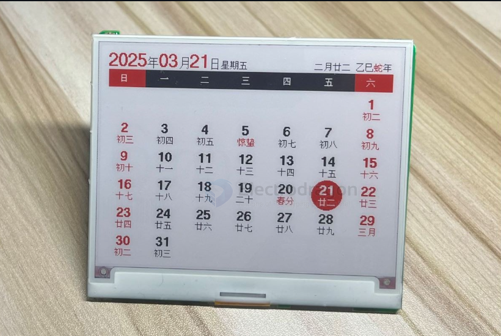

# NRF5x-dat

## chip 

`NRF5340`-QKAA-R AQFN-94 双核蓝牙5.2低功耗BLE无线微控制器

`NRF54L15`-QFAA-R QFN-48 低功耗蓝牙BLE无线 MCU微控制器芯片

`NRF52840`-CKAA-R7 WLCSP-93蓝牙5.2低功耗BLE无线MCU微控制器

`NRF52840`-QFAA-F-R7 QFN-48 蓝牙5.2低功耗BLE无线 微控制器

NRF52833-QIAA-R QFN-73 蓝牙5.3低功耗BLE无线 微控制器芯片

NRF52820-QDAA-R QFN-40 蓝牙5.2低功耗BLE无线微控制器芯片

NRF52810-QFAA-R UQFN-48 蓝牙5.0低功耗BLE无线微控制器芯片

NRF52805-CAAA-R WLCSP-28低功耗蓝牙5.0、2.4GHz无线SoC芯片

- [[NRF52810-dat]] - [[NRF51822-dat]] - [[NRF52832-dat]] - [[NRF52840-dat]]

- [[ARM-dat]]

- [[NRF5x-dat]] - [[NRF5x-SDK-dat]] - [[NRF52832-dat]] - [[NRF52840-dat]]

## APPs 

### epaper driver code 

The e-paper firmware comes with a web-based host application. You can transfer images to the e-paper display via Bluetooth, or set the display to calendar mode (supports lunar calendar, solar terms, and holiday schedule adjustments).

Supported main control chips: nrf51822 / nrf51802 / nrf52811 / nrf52810

Supported e-paper drivers: UC8176 / UC8276 / SSD1619 / SSD1683 / JD79668 (black & white / three-color / four-color e-paper displays)

Also supports custom mapping of e-paper display pins to the MCU, sleep/wake (NFC / wireless charger), and Bluetooth OTA firmware

original code - https://github.com/tsl0922/EPD-nRF5

folk version - https://github.com/Edragon/EPD-nRF5

## ref 

- [[nordic-dat]]