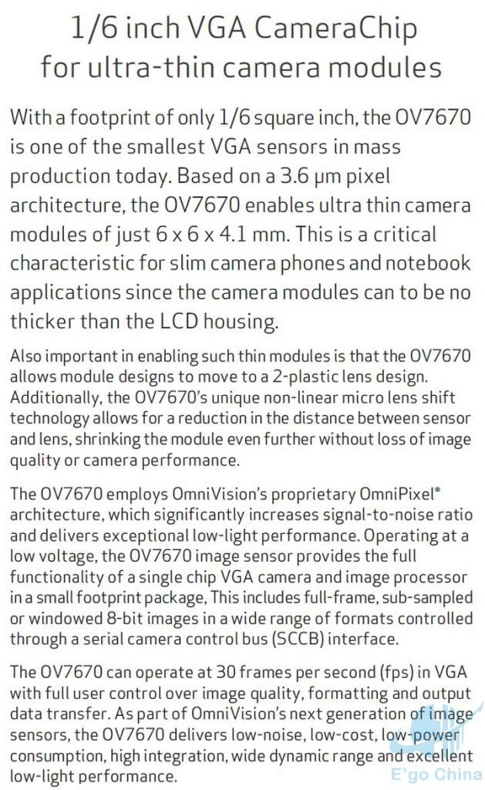
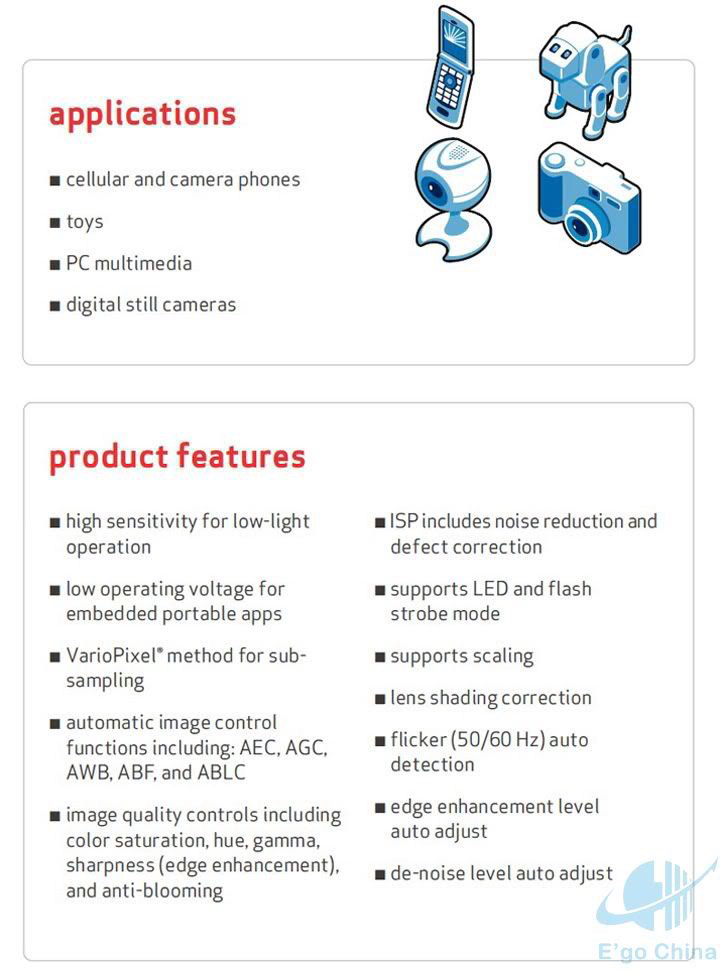
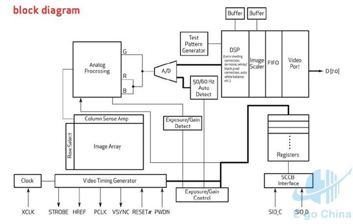

# OV7670-dat

## Features 
- The Ov7670 image sensor is small in size, low in operating voltage, and provides all the functions of a single-chip VGA camera and image processor.
- Through SCCB bus control, various resolution 8-bit impact data can be output in the form of full frame, sub-sampling, windowing, etc.
- The VGA image of this product reaches a maximum of 30 frames/second.
- Users have complete control over image quality, data format and transfer method.
- All image processing functions including gamma curve, white balance, saturation, color, etc. can be programmed through the SCCB interface.

## ref 

- [[OV7670-ds.pdf]]

- [[SCCB-dat]]

- [[omni-vision-dat]]