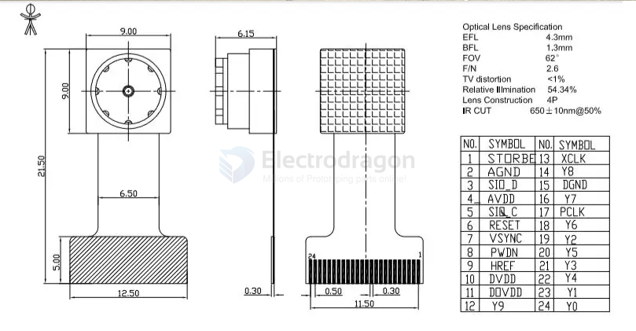
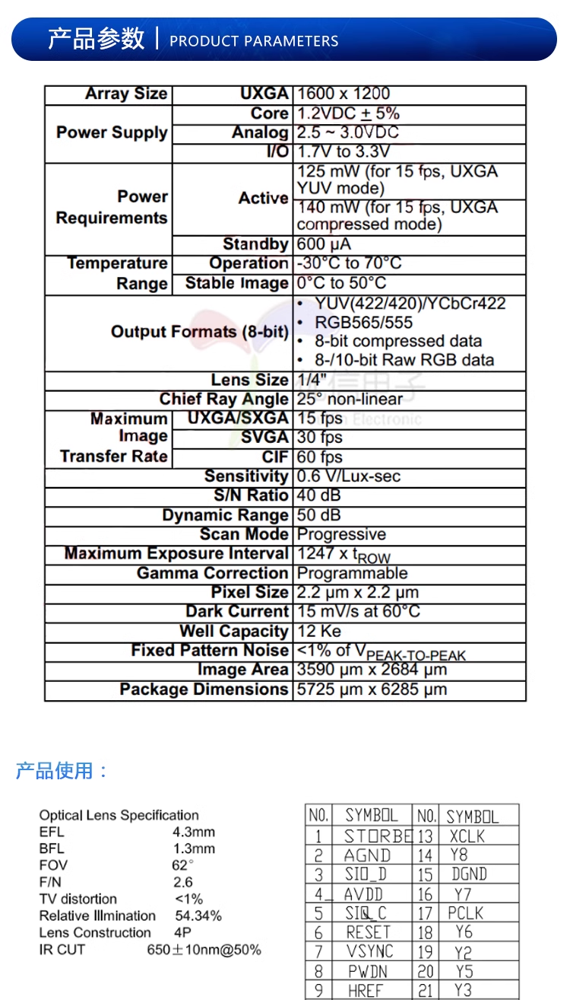
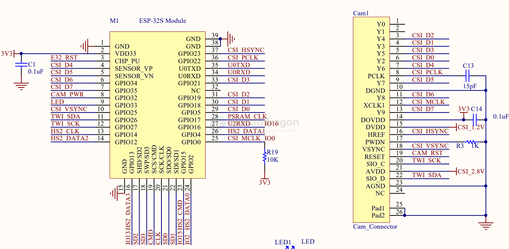
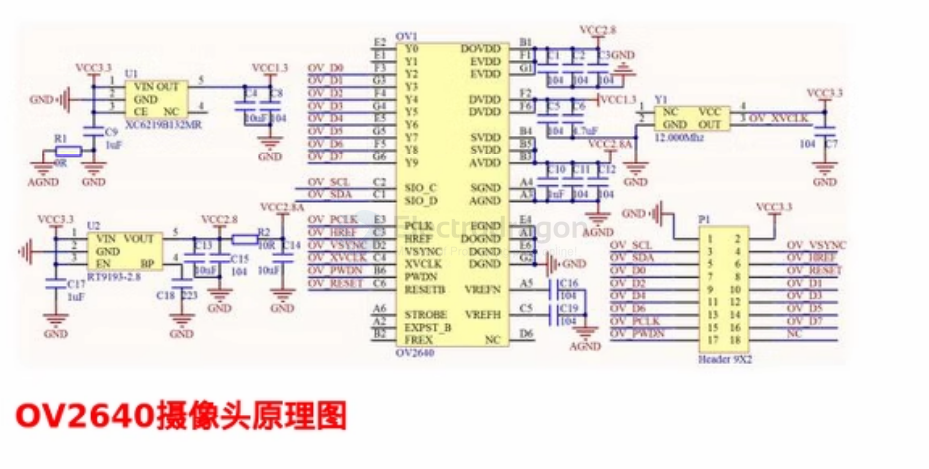

# OV2640-dat

- [[camera-dat]]

- [[OV2640DS.pdf]]

OV2640 Camera Module 2 Million Pixels HDF3M-811

## Dimension 

## specs 

## SCH w/ESP32

- [[SCM1030-dat]]

define as 

    #elif defined(CAMERA_MODEL_AI_THINKER)
    #define PWDN_GPIO_NUM  32
    #define RESET_GPIO_NUM -1

    #define XCLK_GPIO_NUM  0
    #define SIOD_GPIO_NUM  26
    #define SIOC_GPIO_NUM  27

    #define Y9_GPIO_NUM    35
    #define Y8_GPIO_NUM    34
    #define Y7_GPIO_NUM    39
    #define Y6_GPIO_NUM    36
    #define Y5_GPIO_NUM    21
    #define Y4_GPIO_NUM    19
    #define Y3_GPIO_NUM    18
    #define Y2_GPIO_NUM    5
    
    #define VSYNC_GPIO_NUM 25
    #define HREF_GPIO_NUM  23
    #define PCLK_GPIO_NUM  22

    // 4 for flash led or 33 for normal led
    #define LED_GPIO_NUM   4

in a table : 

| OV2640 CAMERA | group    | ESP32   | functions for OV2640 |
| ------------- | -------- | ------- | -------------------- |
| D0            | data 0~7 | GPIO 5  | Y2_GPIO_NUM          |
| D1            | data 0~7 | GPIO 18 | Y3_GPIO_NUM          |
| D2            | data 0~7 | GPIO 19 | Y4_GPIO_NUM          |
| D3            | data 0~7 | GPIO 21 | Y5_GPIO_NUM          |
| D4            | data 0~7 | GPIO 36 | Y6_GPIO_NUM          |
| D5            | data 0~7 | GPIO 39 | Y7_GPIO_NUM          |
| D6            | data 0~7 | GPIO 34 | Y8_GPIO_NUM          |
| D7            | data 0~7 | GPIO 35 | Y9_GPIO_NUM          |
| XCLK          | CSI      | GPIO 0  | XCLK_GPIO_NUM        |
| PCLK          | CSI      | GPIO 22 | PCLK_GPIO_NUM        |
| VSYNC         | CSI      | GPIO 25 | VSYNC_GPIO_NUM       |
| HREF          | CSI      | GPIO 23 | HREF_GPIO_NUM        |
| SDA           | I2C      | GPIO 26 | SIOD_GPIO_NUM        |
| SCL           | I2C      | GPIO 27 | SIOC_GPIO_NUM        |
| POWER PIN     | ctrl     | GPIO 32 | PWDN_GPIO_NUM        |

## OV2640-dat

| Voltage Type | set   | Voltage Range |
| ------------ | ----- | ------------- |
| DVDD         | 1.2V ? | 1.2-1.5V      |
| AVDD         | 2.8V ? | 2.5-3.0V      |
| DOVDD IO     | 2.8V ? | 1.7-3.3V      |

## ref 

- [[MIPI-CSI-dat]] - [[Camera-dat]]

- [[LDO-2CH-dat]]