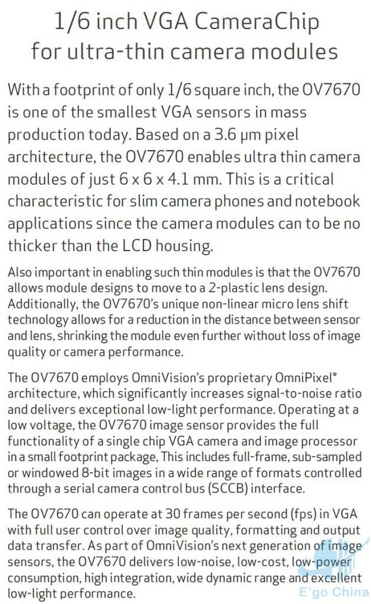
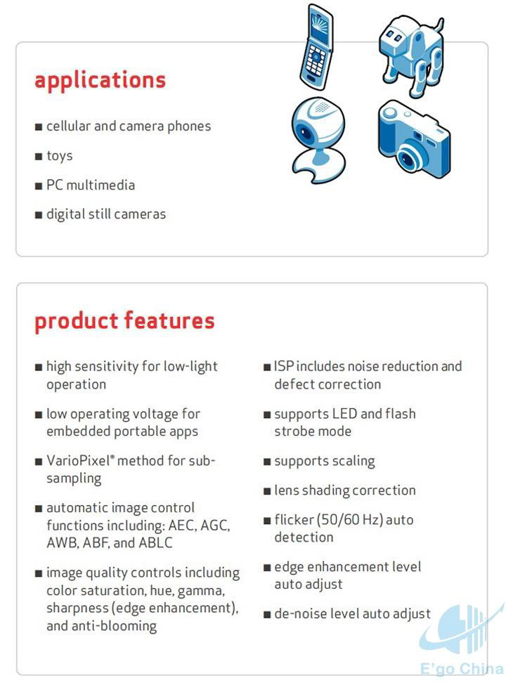
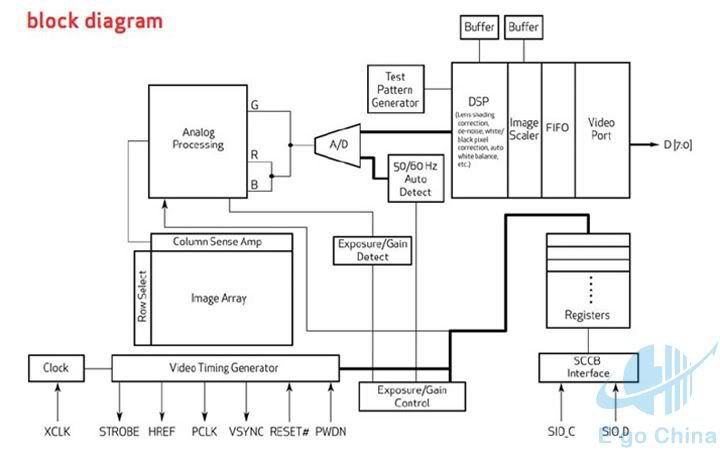
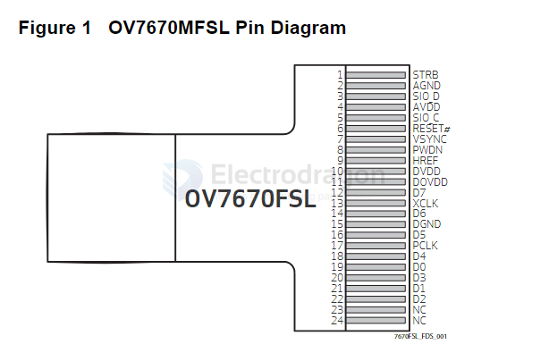
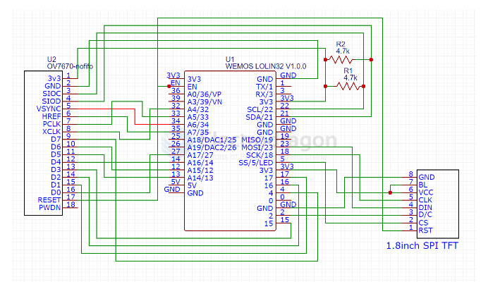

# OV7670-dat

## Features 
- The Ov7670 image sensor is small in size, low in operating voltage, and provides all the functions of a single-chip VGA camera and image processor.
- Through SCCB bus control, various resolution 8-bit impact data can be output in the form of full frame, sub-sampling, windowing, etc.
- The VGA image of this product reaches a maximum of 30 frames/second.
- Users have complete control over image quality, data format and transfer method.
- All image processing functions including gamma curve, white balance, saturation, color, etc. can be programmed through the SCCB interface.

## interface 

Serial Camera Control Bus (SCCB) interface

## SCH 

w/ESP32

## demo code repo

- https://github.com/bitluni/ESP32CameraI2S
- https://github.com/igrr/esp32-cam-demo (archieved, merge into main esp32 repo)
- https://github.com/LilyGO/ESP32-Camera-OV7725/blob/master/ESP32_Camera/ESP32_I2S_Camera.ino

setup 

    #include <WiFi.h>
    #include <WiFiMulti.h>
    #include <WiFiClient.h>
    #include "BMP.h"

    const int SIOD = 21; //SDA
    const int SIOC = 22; //SCL

    const int VSYNC = 34;
    const int HREF = 35;

    const int XCLK = 32;
    const int PCLK = 33;

    const int D0 = 27;
    const int D1 = 17;
    const int D2 = 16;
    const int D3 = 15;
    const int D4 = 14;
    const int D5 = 13;
    const int D6 = 12;
    const int D7 = 4;

    const int TFT_DC = 2;
    const int TFT_CS = 5;
    //DIN <- MOSI 23
    //CLK <- SCK 18

    #define ssid1        "TP-LINK_888"  //Your wiff id
    #define password1    "Zhang520521" //Your wiff password

## ref 

- [[OV7670-ds.pdf]]

- [[SCCB-dat]]

- [[omni-vision-dat]]