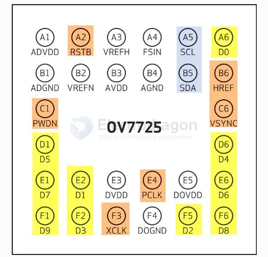
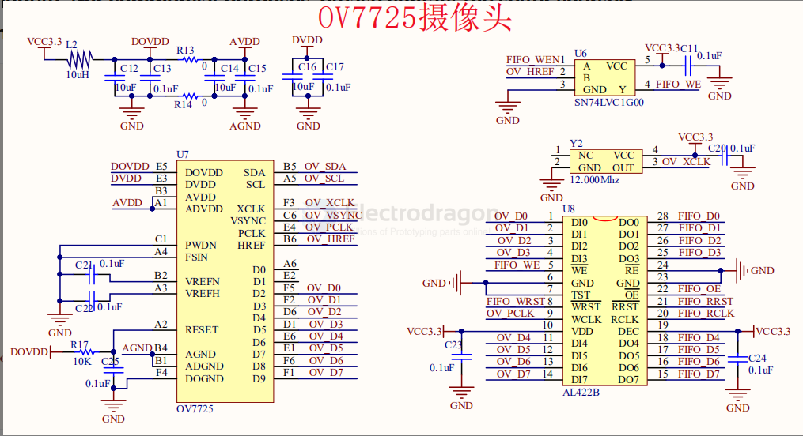
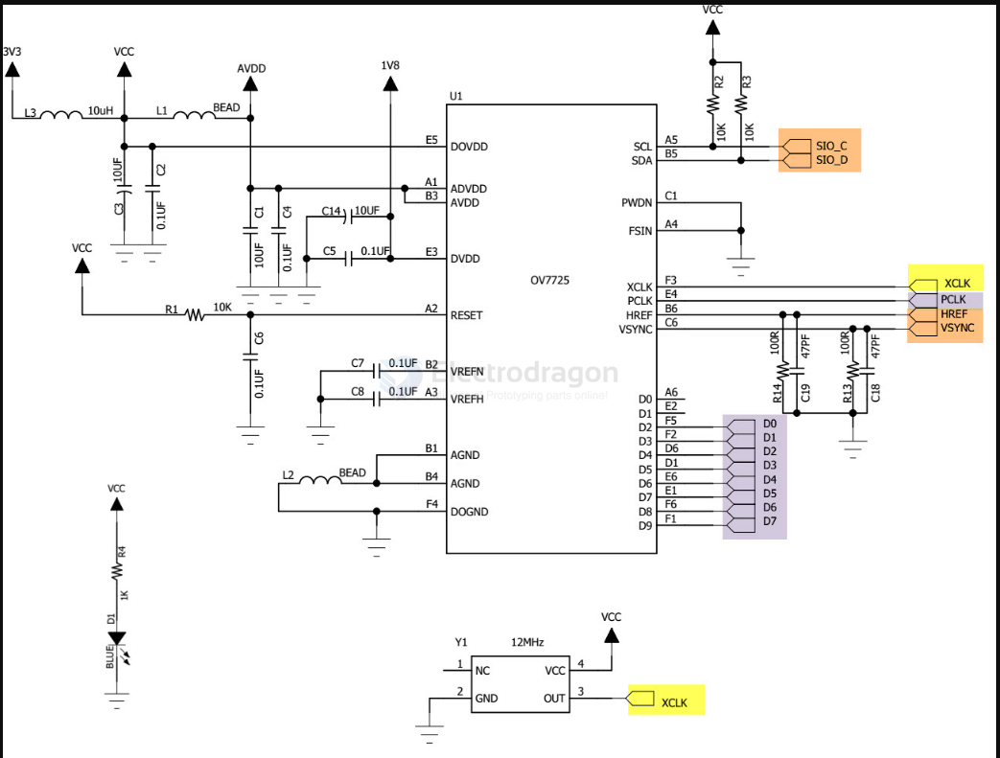
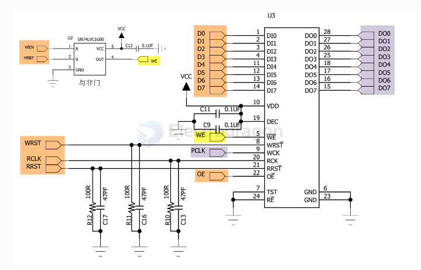
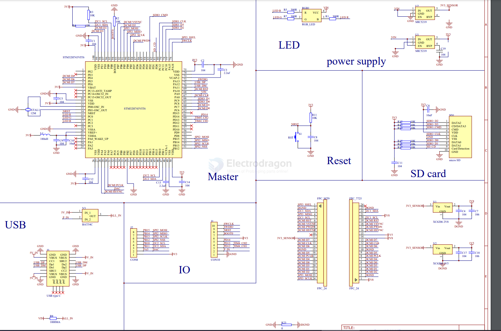

# OV7725-dat

* Up to 60fps on VGA mode
* Can be through the SCCB interface, in fact, is similar to the I2C interface, the white balance, gama, color correction, exposure control, color control.
* sclk and sdat need 4.7K pull-up

## Chip 

The OV7725 sensor uses BGA packaging. Its front end is a lighting window and the pins are all led out on the back. The pin distribution is shown in Figure 47_2.

## silk print 

- HDF7725-BS
- HDF7725-A90
- ...

## SCH 

sch 2 

connect to a [[FIFO-dat]]

Wiring to a [[STM32-dat]] H7 

## ref 

- [[FIFO-dat]] - [[AL422B]]

- https://drive.google.com/file/d/1NdFRoW3jKUBIXRLPa3K5KMaaimx0SyS6/view