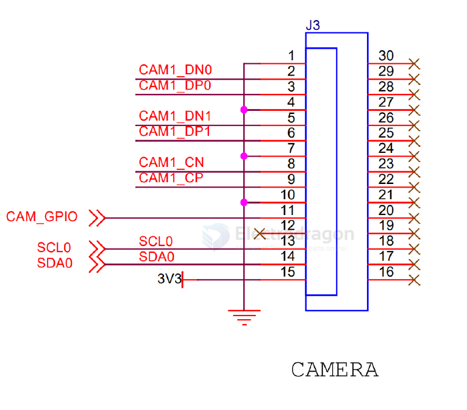

# OV9281-dat

The global shutter camera module utilizes the OV9281 photosensitive chip, featuring a 3μm x 3μm pixel size and OmniPixel3-GSTM technology. 

The global shutter technology allows for simultaneous exposure of all pixels, eliminating motion distortion, and enhancing the ability to capture fast-moving objects with clarity. 

Its 1280x800 resolution and 1 million pixels ensure detailed image capture even in low-light environments, making it ideal for applications like night monitoring and indoor shooting where lighting conditions may be suboptimal.

- datasheet == [[OV9281-DataSheet.pdf]]

## camera interface 

