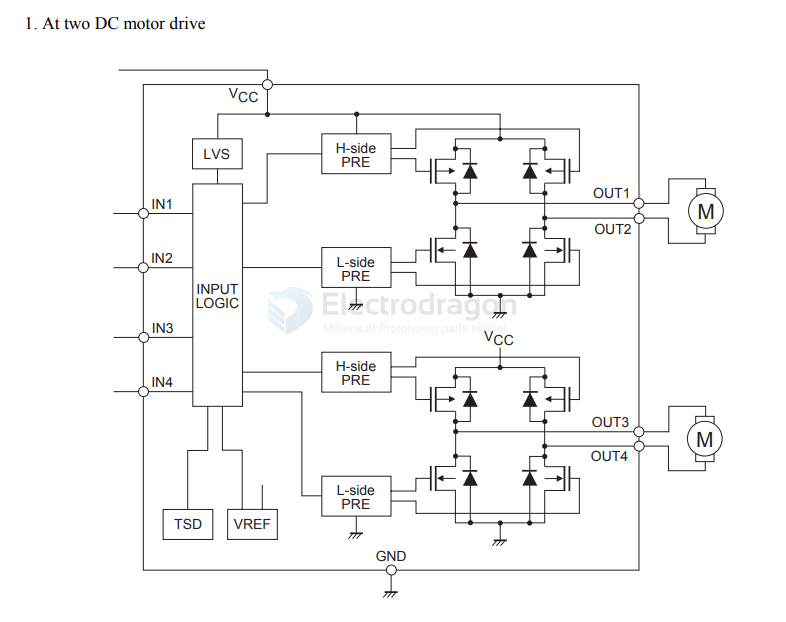
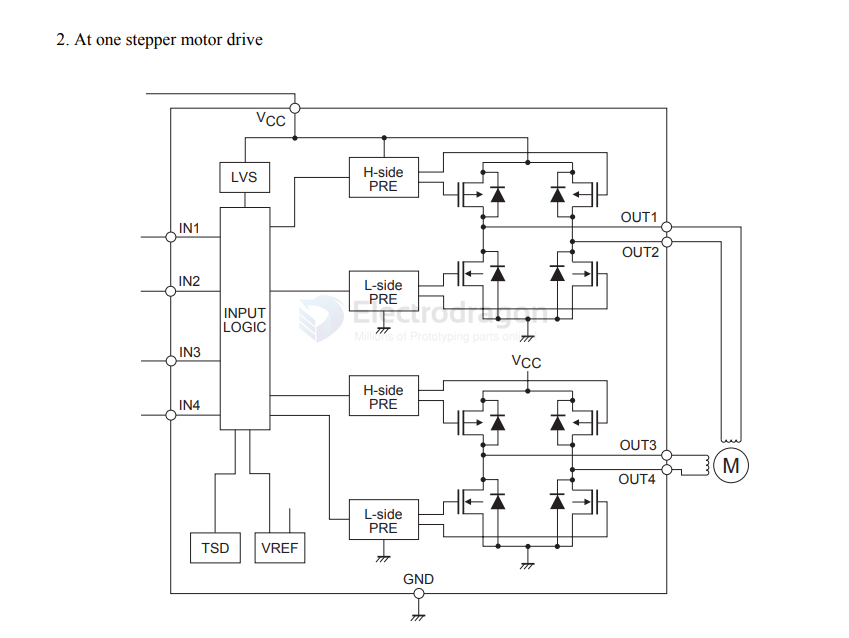

# LV8548-dat

- datasheet == [[onsemi-LV8548MC-AH_C19950.pdf]]

Monolithic Linear IC

12V Low Saturation Voltage Drive Forward/Reversee Motor Driver

Overview

The LV8548MC is a 2-channel low saturation voltage forward/reverse motor driver IC. 

It is optimal for motor drive in 12V system products and can drive either two DC motors, one DC motor using parallel connection, or it can drive a stepper motor in Full-step and Half-step.

## APPs 

## ref 

- [[dc-motor-driver-dat]]