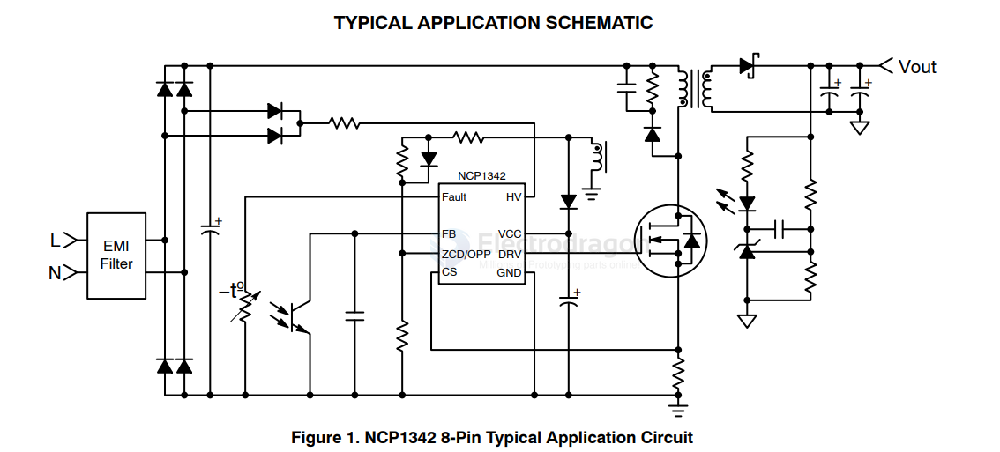
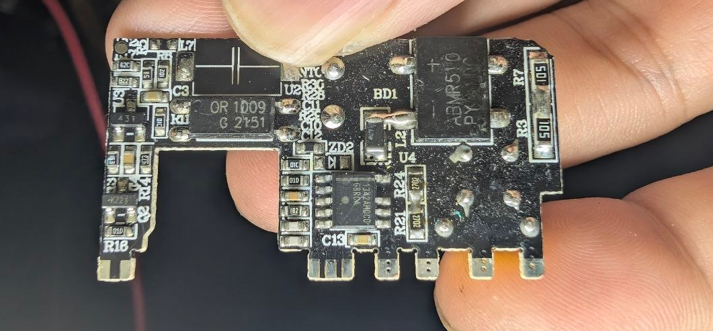

# NCP1342-dat

- [[NCP1342-dat]] - [[onsemi-dat]] - [[power-flyback-controller-dat]] - [[power-dat]] - [[SMPS-dat]] - [[ACDC-dat]]

https://www.onsemi.com/download/data-sheet/pdf/ncp1342-d.pdf

The NCP1342 is a highly integrated quasi-resonant flyback controller suitable for designing high-performance off-line power converters. With an integrated active X2 capacitor discharge feature, the NCP1342 can enable no-load power consumption below 30 mW

## APP 

## build 

- [[optical-coupler-dat]] == Orient OR-1009-TP-G - [[NCP1342-dat]]

## ref 