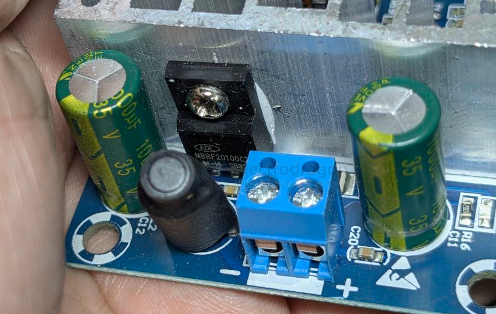

# OnSemi-dat 

- [[usb-hub-dat]]

- [[dcdc-down-dat]]

## Triac Driver Optocoupler

6-Pin DIP Zero-Cross Triac Driver Optocoupler (600 Volt Peak)

MOC3061M, MOC3062M, MOC3063M, MOC3162M, MOC3163M

[MOCD207M, MOCD208M, MOCD211M, MOCD213M, MOCD217M](https://www.onsemi.com/download/data-sheet/pdf/mocd217m-d.pdf)

8-pin SOIC Dual-Channel Phototransistor Output Optocoupler

- [[LV8548-dat]] - [[SG3525-dat]]

- [[optical-coupler-dat]] 

- MOC3031M, MOC3032M, MOC3033M, MOC3041M, MOC3042M, MOC3043M == 6-Pin DIP Zero-Cross Triac Driver Output Optocoupler (250/400 Volt Peak)

- H11L1M, H11L2M, H11L3M - 6-Pin DIP Schmitt Trigger Output Optocoupler

## diode 

[MBRF20100CTG - Switch-mode Schottky Power Rectifier - SCHOTTKY BARRIER RECTIFIER 20 AMPERES, 100 VOLTS](https://www.onsemi.com/pdf/datasheet/mbrf20100ct-d.pdf)

The Switch−mode Power Rectifier employs the Schottky Barrier principle in a large area metal−to−silicon power diode. State−of−the−art geometry features epitaxial construction with oxide passivation and metal overlay contact. Ideally suited for use as rectifiers in very low−voltage, high−frequency switching power supplies, free wheeling diodes and polarity protection diodes.

## ref 

- [[chip-dat]]