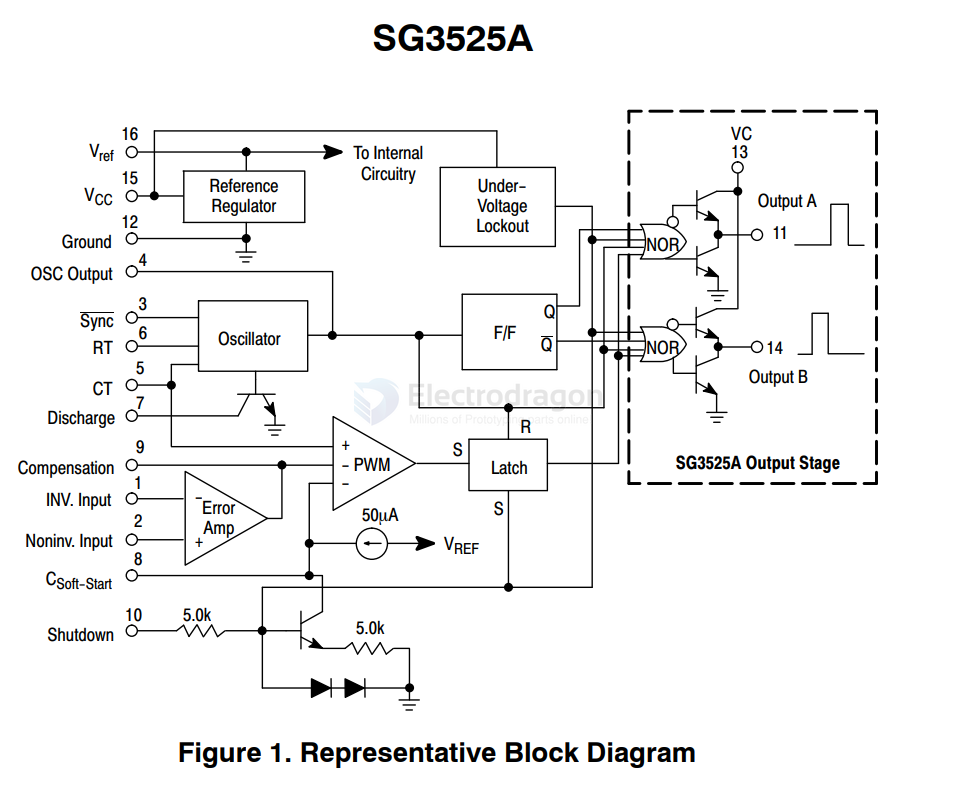
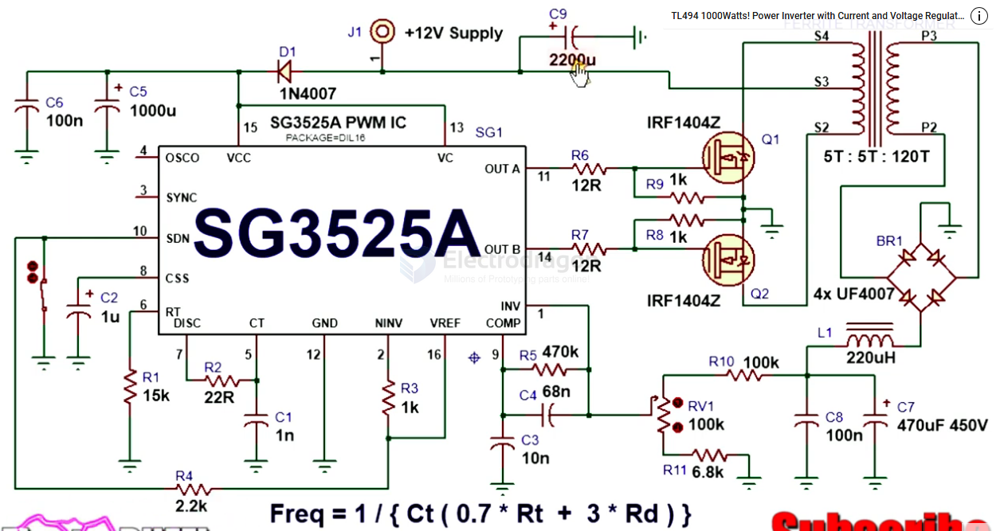
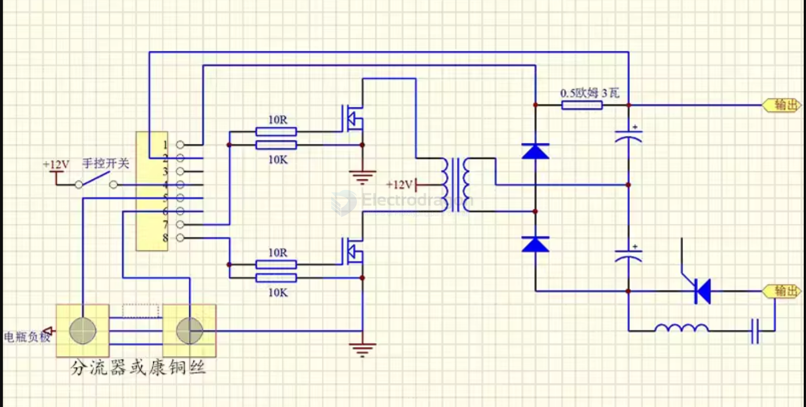

# SG3525-dat

Pulse Width Modulator Control Circuit

- [[MSP1046-dat]]

## Features 

1. Onboard SG3525APWM control chip;
2. Onboard 78M05 voltage regulator chip, providing reliable reference voltage;
3. Two precision adjustable resistors on board, R3 controls the duty cycle, R4 controls the frequency;
4. Onboard power indicator;
5. Working voltage: 8~12V;
6. Frequency range: 200HZ-100KHZ adjustable;
7. Duty cycle: 0-100% adjustable;
8. Output amplitude: 5V;
9. Board size: 30.8 (mm) x18 (mm);

## Block Diagram 

## SCH 

- https://www.youtube.com/watch?v=T8C7dp0U3Ig

## APP Drop-in-Water Short Protector 

- Pin 1: Short circuit sampling + of the rear stage
- Pin 2: Short circuit sampling 1 of the rear stage
- Pin 3: Water protection
- Pin 4: 8-16V power supply positive
- Pin 5: Shunt or constantan wire battery negative terminal
- Pin 6: Shunt or constantan wire sampling load terminal
- Pin 7 and 8: Drive output

## ref 

- [[onsemi-dat]] - [[TL494-dat]]

- [[Oscillator-dat]] - [[crystal-dat]]