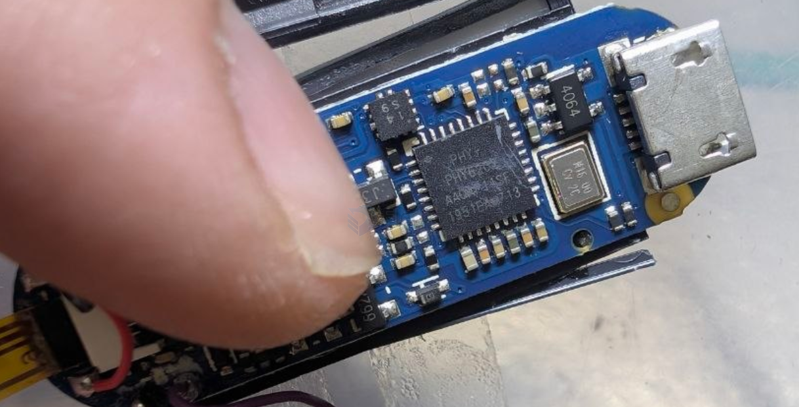

# PHY-co-dat

PHY6202 - Bluetooth Low Energy (BLE) System on Chip

Key Features • ARM® Cortex™-M0 32-bit processor • Memory

- 512/256KB in-system flash memory
- 128KB ROM
- 138KB SRAM, all programmable retention in sleep mode
- 8-channel DMA

https://cdn.hackaday.io/files/1674877165763808/PHY6202_BLE_SOC_Datasheet0809.pdf

## apps 

- [[smartband-dat]]

## ref 

