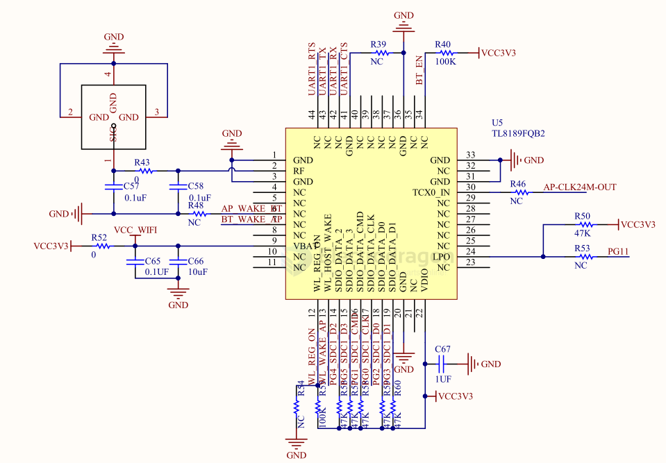

# RTL8189-dat

RTL8189ES

Single-Chip IEEE 802.11b/g/n 1T1R WLAN Controller with SDIO Interface

General Description

The Realtek RTL8189ES-VB-CG is a highly integrated single-chip 802.11n Wireless LAN (WLAN) network SDIO interface (SDIO 1.1/ 2.0/ 3.0 compatible) controller. It is a WLAN MAC, a 1T1R capable WLAN baseband, and WLAN RF in a single chip. The RTL8189ES-VB provides a complete solution for a high-throughput performance integrated wireless LAN device.

https://www.realtek.com/Product/Index?id=594&cate_id=194

## TL8189 SCH to [[F133-dat]]

## ref 

- [[realtek-dat]]