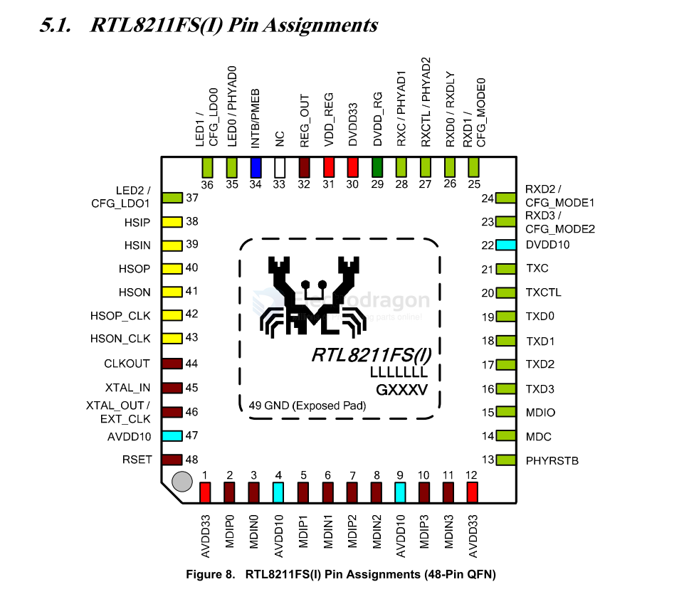
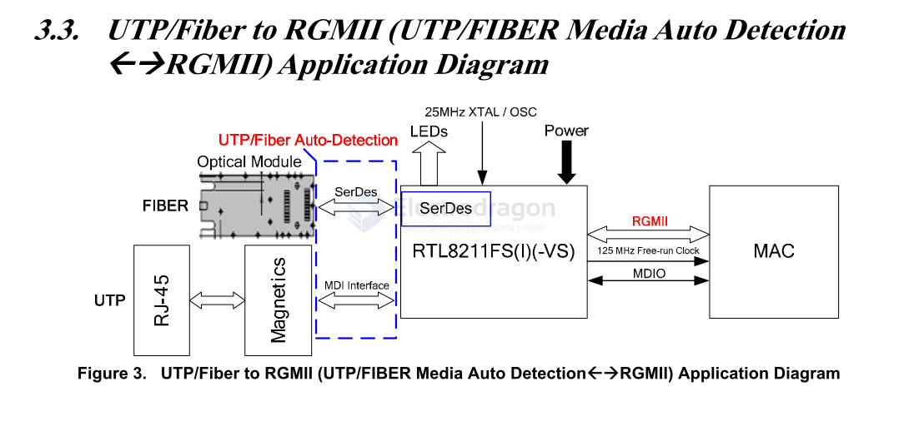
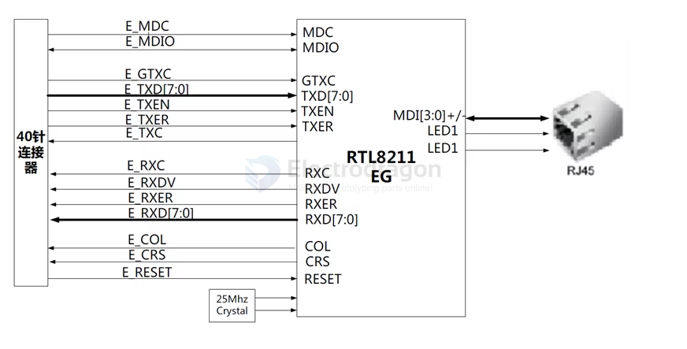
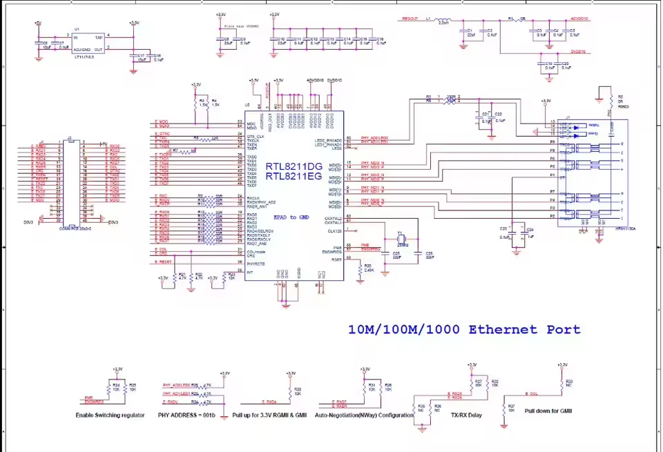
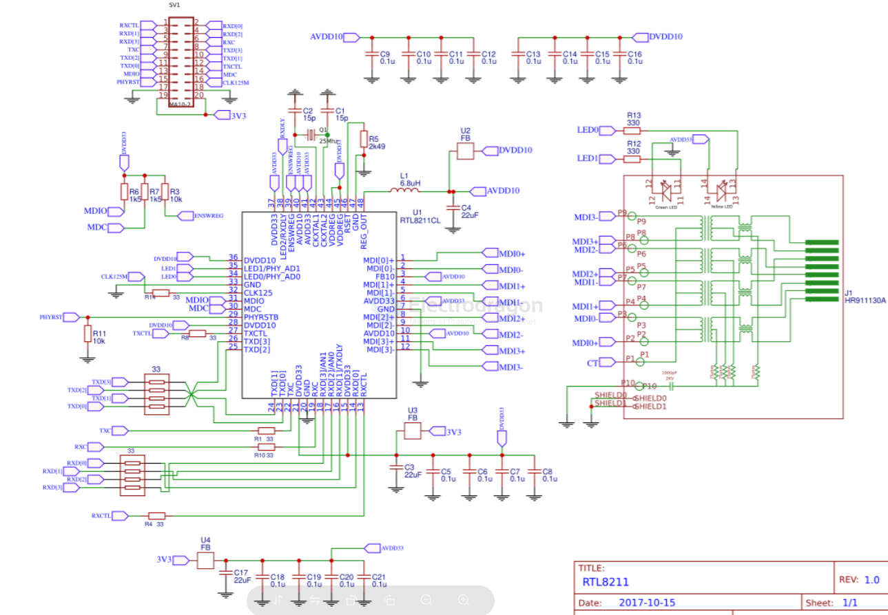
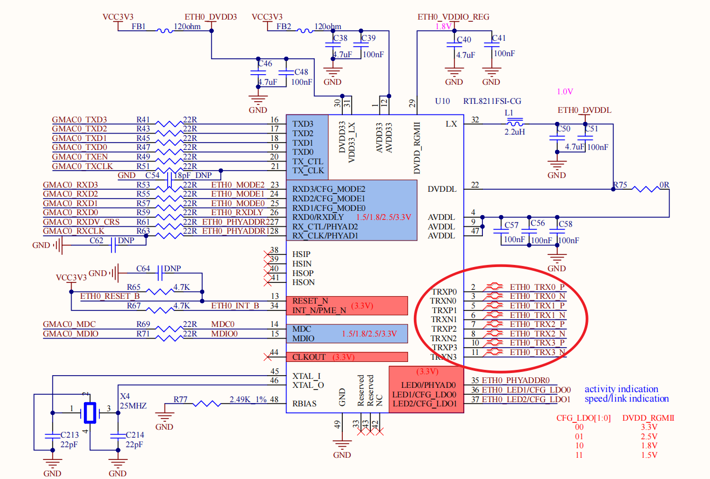

# RTL8211-dat

[RTL8211FD(I)-CG](https://www.realtek.com/Product/Index?id=3976&cate_id=786)

## General Description

The Realtek RTL8211FD-CG/RTL8211FDI-CG is a highly integrated Ethernet transceiver that is compatible with 10Base-T, 100Base-TX, and 1000Base-T IEEE 802.3 standards. It provides all the necessary physical layer functions to transmit and receive Ethernet packets over CAT.5 UTP cable. The RTL8211FDI-CG is manufactured to industrial grade standards.

The RTL8211FD(I)-CG uses state-of-the-art DSP technology and an Analog Front End (AFE) to enable high-speed data transmission and reception over UTP cable. Functions such as Crossover Detection & Auto-Correction, polarity correction, adaptive equalization, cross-talk cancellation, echo cancellation, timing recovery, and error correction are implemented in the RTL8211FD(I)-CG to provide robust transmission and reception capabilities at 10Mbps, 100Mbps, or 1000Mbps.

Data transfer between MAC and PHY is via the Reduced Gigabit Media Independent Interface (RGMII) for 1000Base-T, 10Base-T, and 100Base-TX. The RTL8211FD(I)-CG supports various RGMII signaling voltages, including 3.3, 2.5, 1.8, and 1.5V.

- 1000Base-T
- 10Base-T
- 100Base-TX

The RTL8211FD(I)-CG incorporates a linear Low-Dropout Regulator (LDO) that features high power supply ripple rejection and low output noise. The built-in LDO means a power inductor is not required for the RTL8211FD(I)-CG; only an output capacitor is required between the 1.0V output and the analog ground for phase compensation, which saves cost and PCB real estate.

## Pin Assignments 

## Apps 

- [[fiber-optic-dat]] - [[MDI-dat]] - [[RGMII-dat]] - [[RJ45-dat]] - [[PHY-dat]]

- [[network-dat]]

### Demo Board 

Gigabit ethernet phy 1000base-tx RTL8211CL

### RTL8211 with RK356x

[source info ](https://blog.csdn.net/CATTLE_L/article/details/144767114)

## ref 

- [[RGMII-dat]] - [[realtek-dat]]