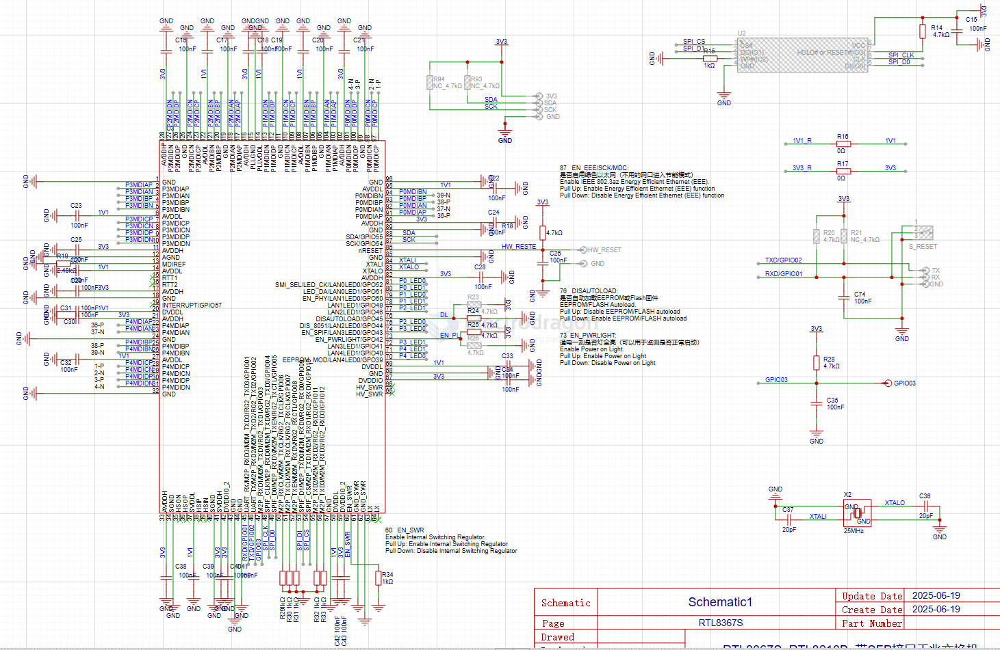

# RTL8367-dat

# RTL8367 Main Features

- 5/8/10-port 10/100/1000 Mbps Gigabit Ethernet switch controller
- Supports IEEE 802.1Q VLAN, 802.1p QoS, and IGMP snooping
- Supports port-based VLAN and tag-based VLAN
- Jumbo frame support (up to 9K bytes)
- Advanced QoS with 4/8 priority queues per port
- Supports port trunking/link aggregation
- Supports port mirroring and loop detection
- Supports IEEE 802.3az Energy Efficient Ethernet (EEE)
- Supports cable diagnostics and auto MDI/MDIX
- Integrated MAC and PHY for all ports
- Management via I2C, SMI, or SPI interface
- Supports LED indicators for link/activity/speed
- Low power consumption, suitable for embedded and consumer networking devices

Note: The exact feature set may vary slightly depending on the RTL8367 variant (e.g., RTL8367N, RTL8367RB, RTL8367S, etc.), but these are the typical main features for the RTL8367 family.

## sch 

