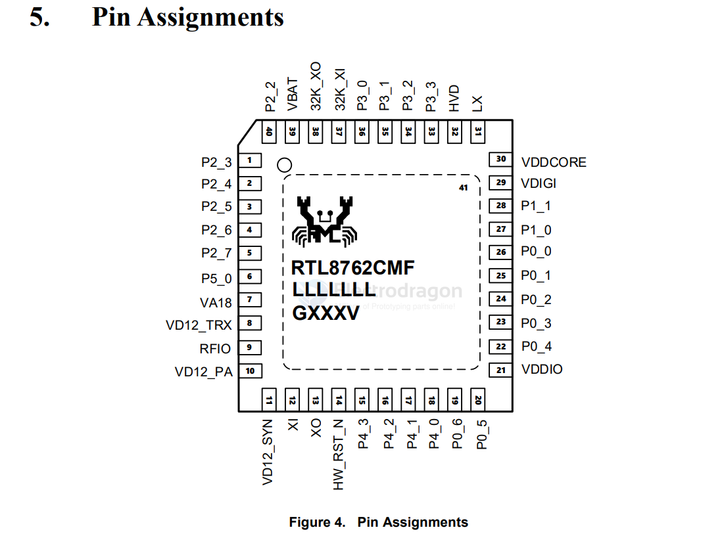

# RTL8762-dat

- [[RTL8762-dat]] - [[realtek-dat]]

- [[insta360-go2-dat]] - [[insta360-dat]]

The RTL8762CMF is an ultra-low-power, highly integrated Bluetooth 5.0 Low Energy (BLE) System-on-Chip (SoC) developed by Realtek. It is widely utilized in smart home devices, wearables, and industrial IoT applications that require robust wireless connectivity.

- [[RTL8762-DS.pdf]]

test pin 

| pin | name   | function                    | output |
| --- | ------ | --------------------------- | ------ |
| 38  | 32K_XO |                             | y      |
| 37  | 32K_XI |                             | y      |
| 31  | LX     | Switching regulator output. | y      |
| 33  | P3_3   |                             | y      |
| 05  | P2_7   |                             | y      |
| 06  | P5_0   |                             | y      |

## ref 

