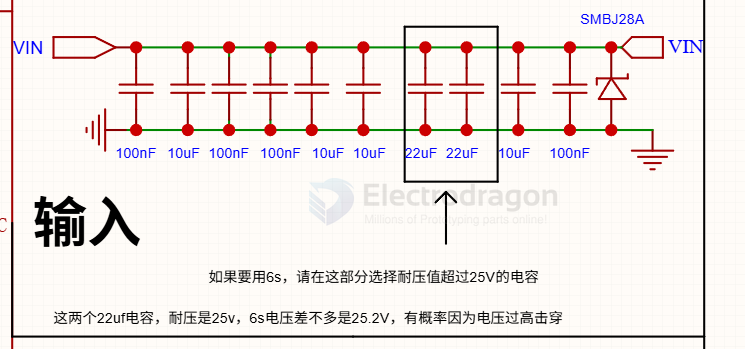
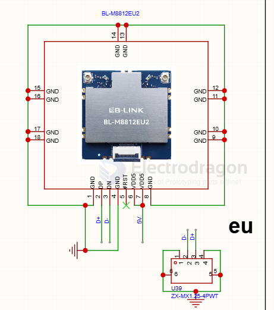

# RTL8812-dat

## SCH 

- [[TPS5430-dat]] - [[dcdc-down-dat]] - [[TPS5450-dat]] - [[RTL8812-dat]]

to [[SSC338-dat]] == - [[TPS5430-dat]] 3V3 

to [[RTL8812-dat]] == - [[TPS5450-dat]] 5V 

## EU 

## RTL8812AU 

目前最远飞过38公里 机载地面都是T4U网卡

- [[TPLINK-dat]] - [[TPLINK-T4U-dat]] - [[RTL8812-dat]]

## app 

- [[openIPC-dat]] - [[VRX-dat]]

## info 

rtl8812au > rtl8812eu

8812eu 网卡 1w

- [[RTL8812-dat]] - [[openIPC-dat]]

- [[Realtek-dat]] - [[RTL8812-dat]] - [[RTL8822-dat]]

- [[wifi-dat]]

## ref 

- [[realtek]] - [[RTL8812]]