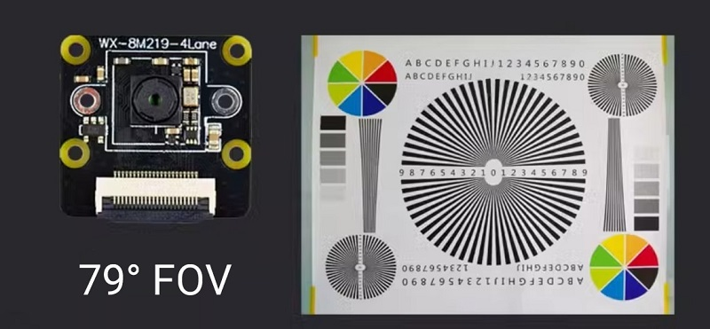
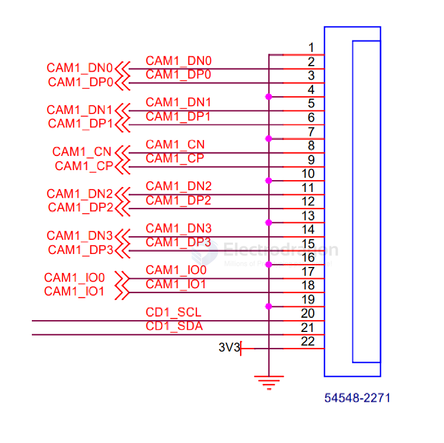

# SONY-dat

## Camera 

- [[sensor-Camera-dat]]

### IMX219 

- [[IMX219-dat]] datasheet == [[IMX219-DataSheet.pdf]] 

Diagonal 4.60 mm (Type 1/4.0) 8 Mega-Pixel CMOS Image Sensor with Square Pixel for Color Cameras 

#### High-Resolution (3280x2464) Imaging

With an 8MP resolution (3280x2464), this Raspberry Pi 5 camera module delivers sharp, detailed images, ensuring high-quality output for both static and dynamic content. The 79.3° field of view guarantees comprehensive capture without distortion, making it suitable for a wide range of applications, including security cameras and visual inspections.

Figure: IMX219-77-4Lane 8MP Raspberry Pi 5 Camera Module Test Shot at 50cm - Approximate Horizontal Field: 62cm, Vertical Field: 47cm (Manual Measurement, Allow for Error)

#### How to Choose IMX219-77-4Lane camera module

The IMX219-77-4Lane camera module is available in two versions: 

79° FOV (this one) and 120° FOV. The 79° FOV version offers a narrower, more focused field of view, making it ideal for applications requiring precision and detail, such as industrial automation, object recognition, and close-range inspections. 

The 120° FOV wide-angle version, designed for broader area capture, is perfect for security surveillance, smart home monitoring, autonomous robots, and large-scale visual inspections. Its wider field of view allows for fewer cameras to cover larger spaces, reducing blind spots in monitoring systems.

#### camera interface 

### IMX378 

- [[IMX378-dat]]

## ref 

- [[chip-dat]]