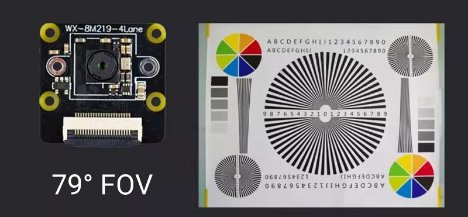
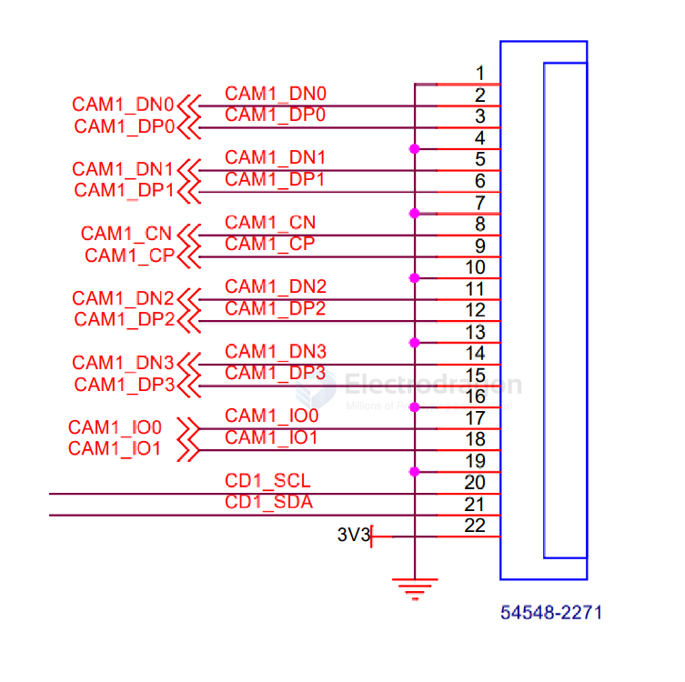

# SONY-dat

- [[IMX708-dat]] - [[IMX415-dat]] - 

The ISX031-GMSL-Camera-Hxx camera module is designed based on the Sony automotive-grade CMOS image sensor `ISX031`

## IMX362 vs IMX398 — Parameter Comparison

### Sensor Specifications

| Parameter              | IMX362                      | IMX398              |
| ---------------------- | --------------------------- | ------------------- |
| Sensor Size            | 1/2.55" (larger)            | 1/2.8"              |
| Pixel Size             | 1.4μm (larger)              | 1.12μm              |
| Resolution             | 12 MP                       | 16 MP               |
| Autofocus              | Dual Pixel (full-pixel)     | Dual Pixel          |
| Representative Devices | Pixel 2, OPPO R11, vivo X20 | OPPO R9s / R9s Plus |

### 🎯 Core Difference: Pixel Size Determines Image Quality

The 1.4μm large pixels of the IMX362 > the 1.12μm pixels of the IMX398:

| Aspect                | IMX362 (1.4μm)               | IMX398 (1.12μm)                    |
| --------------------- | ---------------------------- | ---------------------------------- |
| Light Intake          | ✅ ~56% more light            | Less                               |
| Night Photography     | ✅ Clearly brighter & cleaner | More noise                         |
| Low-light Performance | ✅ Stronger                   | Average                            |
| Resolution            | 12 MP (sufficient)           | 16 MP (higher number, but noisier) |

**In short:** Sensor size rules — the IMX362's larger sensor + larger pixels = crushing low-light performance over the IMX398. The IMX398's only "advantage" is the 16 MP count that sounds impressive, but in practice it produces more noise and worse night shots.

### 🎯 Supporting Evidence: Real-World Device Performance

- IMX362 (Pixel 2) → DxOMark score 98, world #1 in 2017
- IMX398 (OPPO R9s Plus) → Decent photos, but far from Pixel 2's level

### Conclusion

Choose IMX362 devices (Pixel 2 / OPPO R11 / vivo X20), not the IMX398 (R9s Plus) — at the same price point, the IMX362 delivers noticeably better photos.

- [[IMX362-dat]] - [[pixel2-dat]] - [[IMX398-dat]]

## Camera 

- [[sensor-Camera-dat]]

### IMX219 

- [[IMX219-dat]] datasheet == [[IMX219-DataSheet.pdf]] 

Diagonal 4.60 mm (Type 1/4.0) 8 Mega-Pixel CMOS Image Sensor with Square Pixel for Color Cameras 

#### High-Resolution (3280x2464) Imaging

With an 8MP resolution (3280x2464), this Raspberry Pi 5 camera module delivers sharp, detailed images, ensuring high-quality output for both static and dynamic content. The 79.3° field of view guarantees comprehensive capture without distortion, making it suitable for a wide range of applications, including security cameras and visual inspections.

Figure: IMX219-77-4Lane 8MP Raspberry Pi 5 Camera Module Test Shot at 50cm - Approximate Horizontal Field: 62cm, Vertical Field: 47cm (Manual Measurement, Allow for Error)

#### How to Choose IMX219-77-4Lane camera module

The IMX219-77-4Lane camera module is available in two versions: 

79° FOV (this one) and 120° FOV. The 79° FOV version offers a narrower, more focused field of view, making it ideal for applications requiring precision and detail, such as industrial automation, object recognition, and close-range inspections. 

The 120° FOV wide-angle version, designed for broader area capture, is perfect for security surveillance, smart home monitoring, autonomous robots, and large-scale visual inspections. Its wider field of view allows for fewer cameras to cover larger spaces, reducing blind spots in monitoring systems.

#### camera interface 

### IMX378 

- [[IMX378-dat]]

## ref 

- [[chip-dat]]