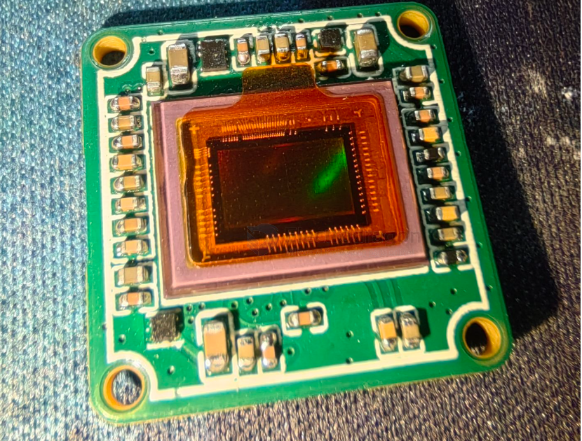
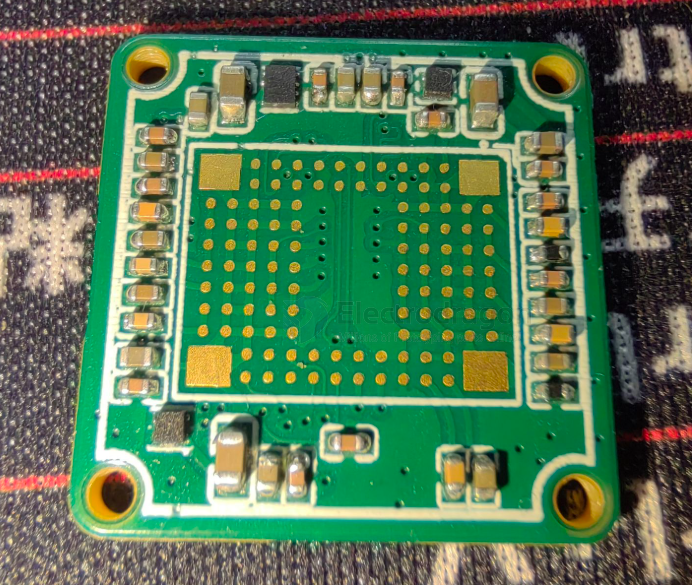
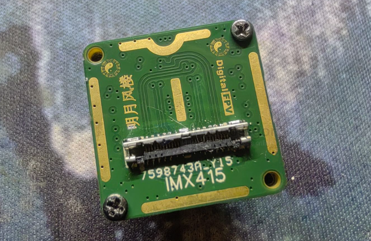
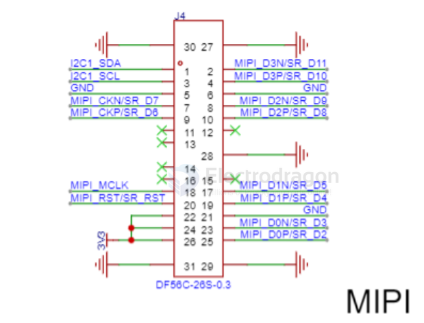
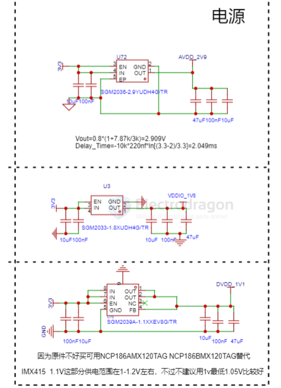
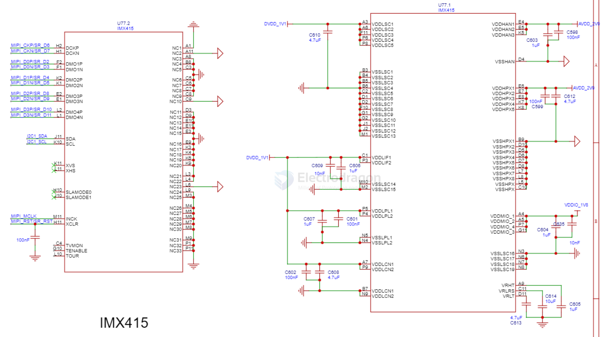
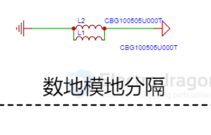

# imx415-dat

- [[IMX415-dat]] - [[IMX307-dat]] - [[sony-dat]] - [[MIPI-dat]]

- [[IMX415-dat]] - [[SSC338-dat]] - [[RTL8812-dat]] - [[PCB-design-complex-dat]]

== 132 CNY == 20 USD 

- [[sony-dat]] - [[IMX415-dat]] - [[camera-IP-dat]]

- [[SSC338-dat]] - [[conn-DF56C-dat]] - [[IMX415-dat]]

## build 

## SCH 

interface - [[conn-DF56-dat]]

power - [[power-dat]] == 2.9V 1.8V 1.1V 

main 

isolation 

## ref 

https://oshwhub.com/cheng_jun/openipc-tu-chuan-imx415?jspm=hub.ss.lb.gc2&jlc_vid=TgUIBQBeQwcPVAcET1cKUl1XQlcPXlZeTwVaBAcCQwcxVlNfR1lZUlNQRVNeVztWKA4dDxMOAgNABAsL