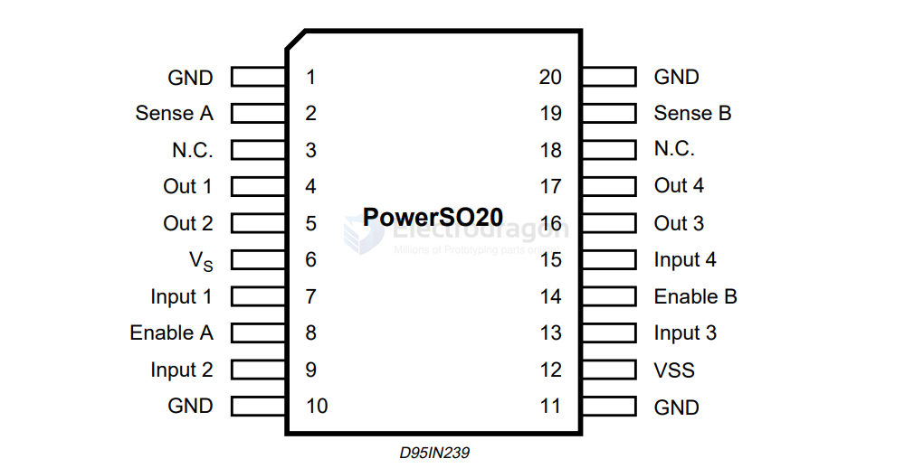
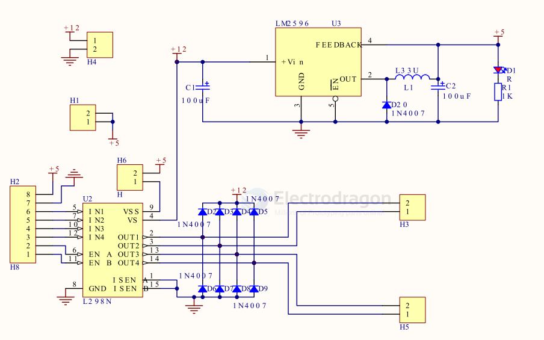

# L298-dat

## Info 
 
chip info, datasheet, etc.

- datasheet: [L298](https://www.ti.com/lit/ds/symlink/l298.pdf)
- [datasheet2](https://www.mouser.sg/datasheet/2/389/l298-1849437.pdf)

## SCH 

SCH with [[LM2596-dat]]

## App. 

- [[SDR1093-dat]] - [[SDR1034-dat]] - [[SDR1048-dat]] - [[SDR1053-dat]]
 
## ref 
 
- [[L298]] 
 