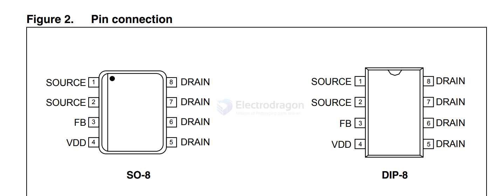
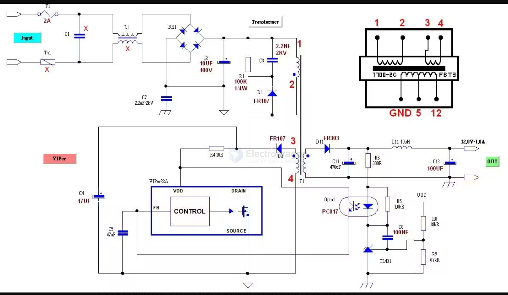
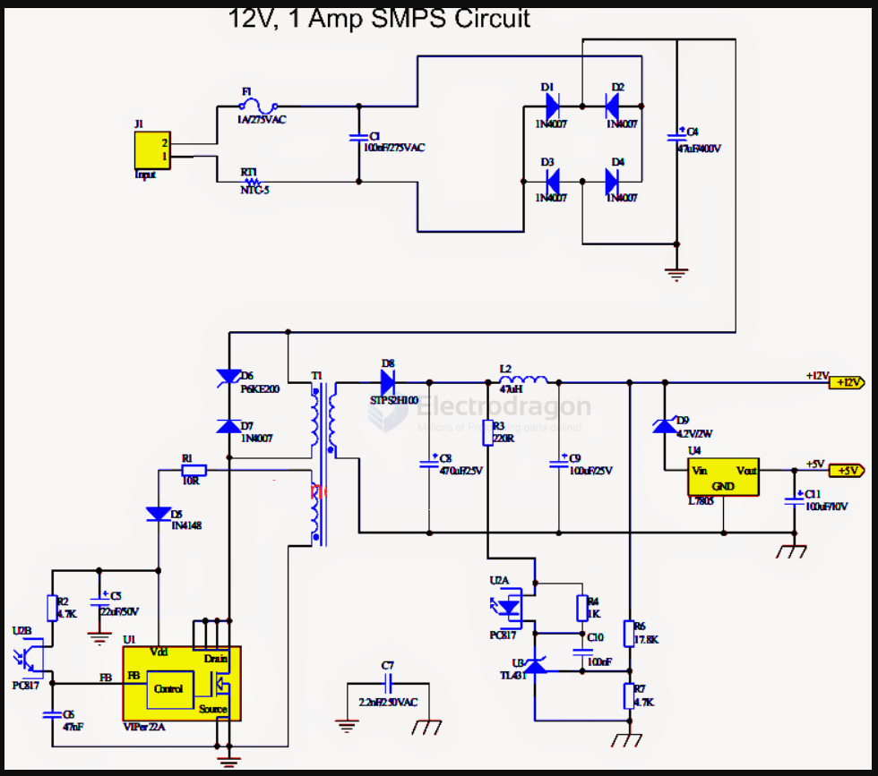

# VIPER22-dat

- [[ST-ACDC-dat]] - [[ACDC-dat]] - [[VIPER22-dat]] - [[VIPER12-dat]]

VIPer22A-E   VIPer22ADIP-E, VIPer22AS-E

Low power OFF-line SMPS primary switcher

https://www.st.com/resource/en/datasheet/viper22a-e.pdf

## APP SCH 

- [[transformer-dat]] - [[TL431-dat]] - [[voltage-reference-dat]]

SCH2 == 12V 1A 

## ref 

