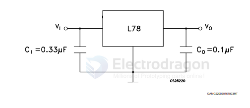
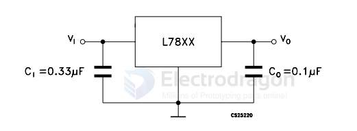

# L78-series-dat

- [[LDO-dat]] - [[ST-power-dat]] - [[L78xx-dat]] - [[ST-power-dat]] - [[ST-dat]] - [[L78-series-dat]]

- [[L78-series-dat]] - [[L79-series-dat]] - [[LM317-dat]] - [[LDO-dat]]

## board 

- [[CKI1034-dat]]

## info 

https://www.st.com/content/ccc/resource/technical/document/datasheet/41/4f/b3/b0/12/d4/47/88/CD00000444.pdf/files/CD00000444.pdf/jcr:content/translations/en.CD00000444.pdf

Positive voltage regulator ICs

Features
- Output current up to 1.5 A
- Output voltages of 5; 6; 8; 8.5; 9; 12; 15; 18; 24 V
- Thermal overload protection
- Short circuit protection
- Output transition SOA protection
- 2 % output voltage tolerance (A version)
- Guaranteed in extended temperature range (A version)

Description
The L78 series of three-terminal positive regulators is available in TO-220,TO-220FP, D²PAK and DPAK packages and several fixed output voltages, making ituseful in a wide range of applications.

These regulators can provide local on-card regulation, eliminating the distributionproblems associated with single point regulation. Each type embeds internal currentlimiting, thermal shut-down and safe area protection, making it essentiallyindestructible. If adequate heat sinking is provided, they can deliver over 1 A outputcurrent. Although designed primarily as fixed voltage regulators, these devices canbe used with external components to obtain adjustable voltage and currents.

## SCH 

# L78xx-dat

- [[L78xx-dat]] - [[L7805-dat]]

- L7805
- L7808 == 8V 
- L7812 == 12V

## ref 

- [[ST-power-dat]]

## ref 

