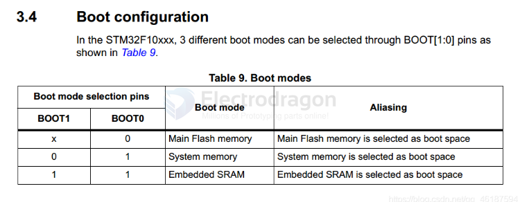
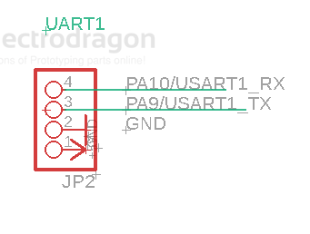
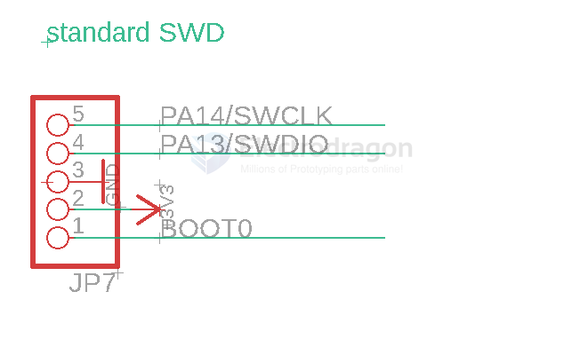

# STM32-dat

legacy wiki page - https://w.electrodragon.com/w/Category:STM32

- [[STM32F103-dat]] - [[STM32F401-dat]] - [[STM32G030-dat]]

- [[STM8-dat]]

## Boards 

- [[DOD1084-dat]]

## Programmer 

based on [[CMSIS-dap-dat]] - [[st-link-dat]] - [[SWD-dat]] - [[serial-dat]] - [[ST-Utility-dat]] - [[openOCD-dat]] - [[jlink-dat]]

- [[DPR1004-dat]] - [[DPR1100-dat]] - [[DPR1130-dat]]

IDE - [[STM32-Cube-G0]]

SDK library - [[STM32-SDK-HAL-dat]]

## Periperals list 

SPI3
- [[flash-dat]] 

Shared SPI2 
-  [[OLED-dat]] - [[LCD-dat]] 

SPI1
- [[NRF24L01-dat]]

Interface 
- [[USB-dat]] - [[Jtag-dat]] - [[can-dat]]

## Boot 

* STM32 microcontroller system memory boot mode - AN2606 - https://www.st.com/content/ccc/resource/technical/document/application_note/b9/9b/16/3a/12/1e/40/0c/CD00167594.pdf/files/CD00167594.pdf/jcr:content/translations/en.CD00167594.pdf

| Setup | Common Pin | User Flash Boot | ISP         | System |
| ----- | ---------- | --------------- | ----------- | ------ |
| Boot0 | Boot0      | 0               | 0           | 1      |
| Boot1 | PB2        | x               | 0           | 1      |
| -     | -          | SWD/JTAG prog   | Serial prog | -      |

### Main Flash memory
It is the built-in Flash of STM32. Generally, when we use JTAG or SWD mode to download the program, it is downloaded to this memory, and the program is directly started from this memory after restarting.

### System memory
Starting from the system memory, the program function started in this mode is set by the manufacturer. 

Generally speaking, this startup method is rarely used. The system memory is a specific area inside the chip. When STM32 leaves the factory, ST presets a BootLoader inside this area, which is what we often call the ISP program. This is a ROM and cannot be modified after leaving the factory. 

Generally speaking, when we choose this startup mode, it is to download the program from the serial port, because the firmware of the serial port download program is provided in the BootLoader provided by the manufacturer, and the program can be downloaded to the system's Flash through this BootLoader.

### Embedded Memory
Built-in SRAM, since it is SRAM, naturally there is no program storage capability. This mode is generally used for program debugging. If I only modify a small part of the code, then I need to erase the entire Flash again, which is time-consuming. I can consider starting the code from this mode (that is, in the memory of STM32) for fast program debugging. After the program debugging is completed, download the program to SRAM.

## UART 

## SWD 

- [[SWD-dat]]

## Demo Code 

https://github.com/Edragon/stm32_COMM
https://github.com/Edragon/STM32-DL-APP
https://github.com/Edragon/STM32_Demo
https://github.com/Edragon/STM32_SDK-examples

- [[DOD1084-dat]] - demo code - https://github.com/Edragon/STM32-F103-M1
- https://github.com/Edragon/STM32-F103-E1
- https://github.com/Edragon/STM32-F103-AT1
- https://github.com/Edragon/STM32-F103-AT2

## Chip Naming 

STM32F103 R C T 6 

STM32F042 C 8 T 6
STM32F042 K 4 T 6
STM32F042 K 6 T 6

- K = 32P
- C = 48P
- R = 64P 
- V = 100
- Z = 144

- C = 256 KB
- D = 384 KB
- E = 512 KB

- H = BGA
- T = LQFP
- Y = WLCSP64

- 6 = Industrial temperature range, –40 to 85 °C.

## Embedded bootloader

The embedded bootloader mode is used to reprogram the Flash memory using one of the following serial interfaces:
* SWD Default 
* USART1 (PA9/PA10)
* USART3 (PB10/11 and PC10/11)
* CAN2 (PB5/13)
* USB OTG FS (PA11/12) in Device mode (DFU: device firmware upgrade).

## ref 

- [[STM32]]

- [[ARM-dat]]