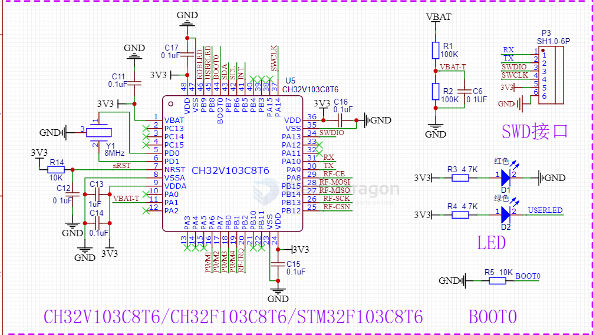

# STM32F103 DAT

STM32F103C6T6 - 32KB

https://www.st.com/en/microcontrollers-microprocessors/stm32f103c6.html

[official chip info](https://www.st.com/en/microcontrollers-microprocessors/stm32f103c8.html) == Mainstream Performance line, Arm Cortex-M3 MCU with 64 Kbytes of Flash memory, 72 MHz CPU, motor control, USB and CAN

[official datasheet](https://www.st.com/resource/en/datasheet/stm32f103c8.pdf)

- USART1 (PA9/PA10)
- BOOT0

## LQFP64 pinout

## LQFP48 pinout

## APPs 

- [[Lora-HDK-dat]]

## min. Core SCH 

## ref 

- [[STM32-dat]]