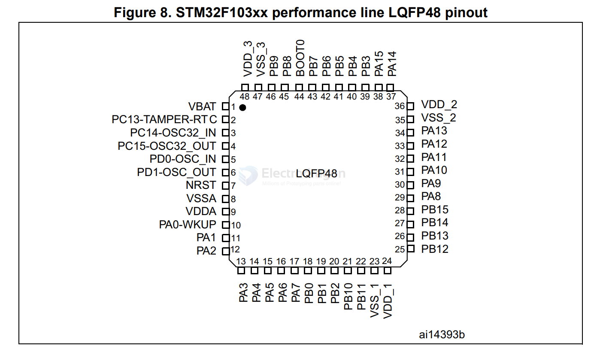

# STM32F103C8T6-dat 

https://www.st.com/en/microcontrollers-microprocessors/stm32f103c8.html

Mainstream Performance line, Arm Cortex-M3 MCU with 64 Kbytes of Flash memory, 72 MHz CPU, motor control, USB and CAN

## Overview 

## feature 

- [[stm32-dat]] - [[STM32F103-dat]]

- [[can-dat]] - [[usb-dat]]