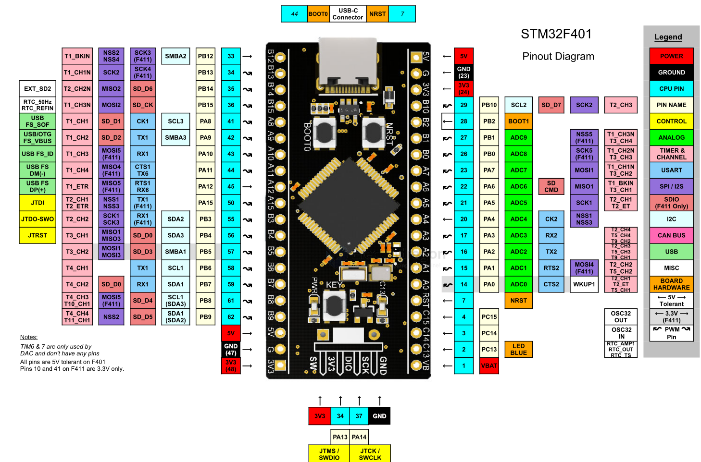
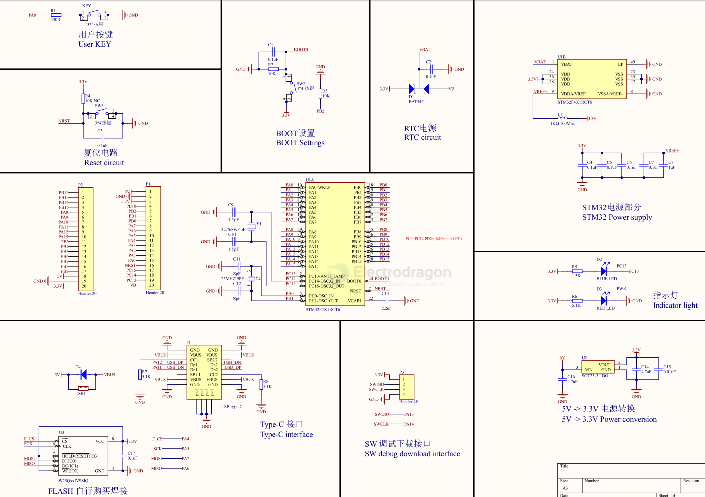

# STM32F401-dat

## dev board pin definitions 

## datasheet 

- [[STM32F401RCT6_DATASHEET.pdf]]
- [[RM0368_STM32F401xBC-STM32F401xDE-Reference manual.pdf]]
- [[DS9716_STM32F401xB-STM32F401xC datasheet.pdf]]

## Demo Code And Reference Link 

managed 
* https://github.com/Edragon/folk-STM32-F4-FW
* https://github.com/Edragon/STM32-F4-examples

3rd party

* https://github.com/mcauser/WEACT_F411CEU6

Firmware Github private

* https://github.com/Edragon/STM32F4_MP-TPY
* https://github.com/Edragon/STM32F4_MP2

## Demo video 

Demo Test for accelerator - facebook dead, please visit at our youtube

* https://fb.watch/bf5FTk2XWO/

## More Notes 

* Use devices delete and pop out devices safely option in windows 
* reconnect USB cable and device to fully reload code

## Other Similar Boards 

* ISOCORE
* TYP_Board

## SCH 

## more schematic 

- https://w.electrodragon.com/w/Category:STM32F4_HDK

## ref 

- [[micropython-dat]]

- [[STM32-dat]]