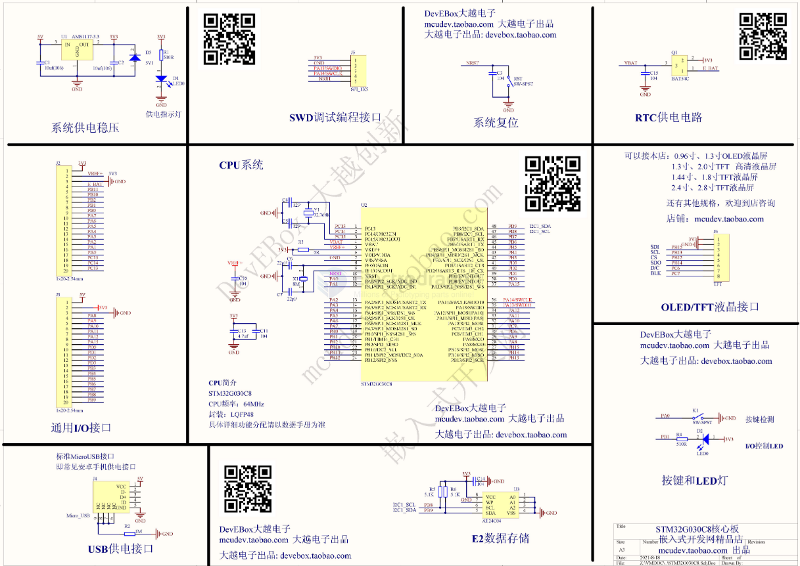
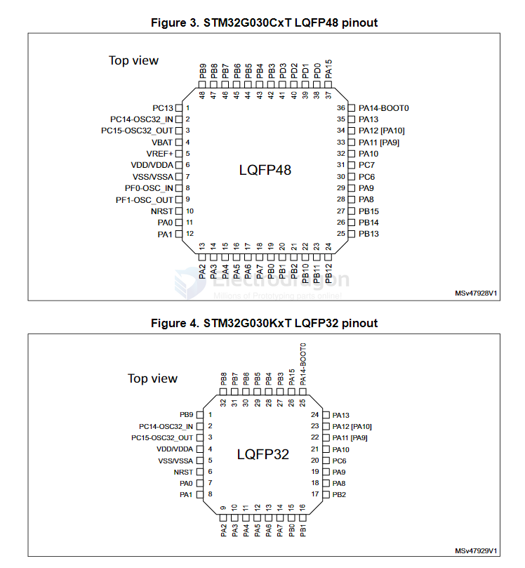

# STM32G030-DAT 

- 2x I2C
- 2x USART
- 2x SPI

Communication interfaces

- Two I2C-bus interfaces supporting Fast-mode Plus (1 Mbit/s) with extra current sink, one supporting SMBus/PMBus and wakeup from Stop mode
- Two USARTs with master/slave synchronous SPI; one supporting ISO7816 interface, LIN, IrDA capability, auto baud rate detection and wakeup feature
- Two SPIs (32 Mbit/s) with 4- to 16-bit programmable bitframe, one multiplexed with I2S interface

LED: PC15

## compare 

| Feature                  | STM32F030                           | STM32G030                           |
|--------------------------|-------------------------------------|-------------------------------------|
| **Core**                 | ARM Cortex-M0                      | ARM Cortex-M0+                      |
| **Clock Speed**          | Up to 48 MHz                        | Up to 64 MHz                        |
| **Flash Memory**         | 16 KB to 64 KB                      | 16 KB to 64 KB                      |
| **RAM**                  | 4 KB to 8 KB                        | 8 KB to 16 KB                       |
| **Peripherals**          | Basic peripherals (GPIO, UART, SPI, I2C, 12-bit ADC) | Enhanced peripherals (GPIO, UART, SPI, I2C, 12-bit or higher ADC) |
| **Power Consumption**    | Low-power modes, basic optimization | Better power efficiency, enhanced low-power features |
| **GPIO Pins**            | Up to 37 pins                       | Up to 24 pins                       |
| **Target Applications**  | Low-cost, simple embedded systems, basic sensors | More complex systems, industrial automation, IoT, motor control |
| **Development Ecosystem**| STM32Cube support                  | STM32Cube support, more advanced features |
| **Cost**                 | Lower cost, budget-friendly         | Slightly higher cost, more features |

## SCH 

## Chip map 

## datasheet 

- [[stm32g030-ds.pdf]]