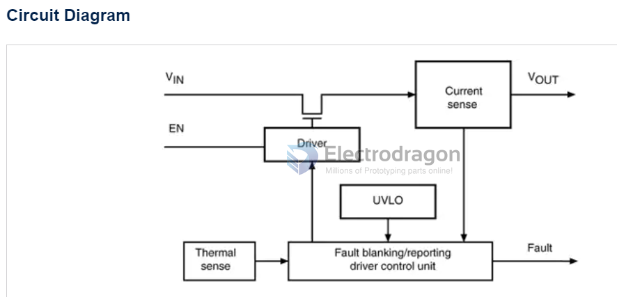

# STMPS21x1-dat

### STMPS 2151

Enhanced single channel power switches

https://www.st.com/en/switches-and-multiplexers/stmps2151.html

The STMPS2141, STMPS2151, STMPS2161, STMPS2171 power distribution switches are intended for applications where heavy capacitive loads and short-circuits are likely to be encountered. These devices incorporate 90 mΩ N-channel MOSFET high-side power switches for power distribution. These switches are controlled by a logic enable input.

All features
- 90 mΩ high-side MOSFET switch
- 500/1000 mA continuous current
- Thermal and short-circuit protection with overcurrent logic output
- Operating range from 2.7 to 5.5 V
- CMOS and TTL compatible enable input
- Undervoltage lockout (UVLO)

- [[RPI-CM4-expansion-board-dat]]

STMPS 2171 STR == 1A 

## ref 

- [[power-switch-dat]]