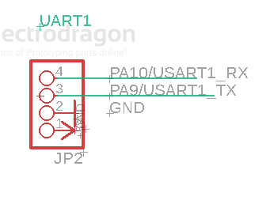

# STM32-dat

- [[STM32F103-dat]] - [[STM32F401-dat]] - [[STM32G030-dat]]

## Boards 

- [[DOD1084-dat]]

## Periperals list 

SPI3
- [[flash-dat]] 

Shared SPI2 
-  [[OLED-dat]] - [[LCD-dat]] 

SPI1
- [[NRF24L01-dat]]

Interface 
- [[USB-dat]] - [[Jtag-dat]]

## Boot 

| Setup | Common Pin | User Flash Boot | ISP | System |
| ----- | ---------- | --------------- | --- | ------ |
| Boot0 | Boot0      | 0               | 0   | 1      |
| Boot1 | PB2        | x               | 0   | 1      |

## UART 

## SWD 

