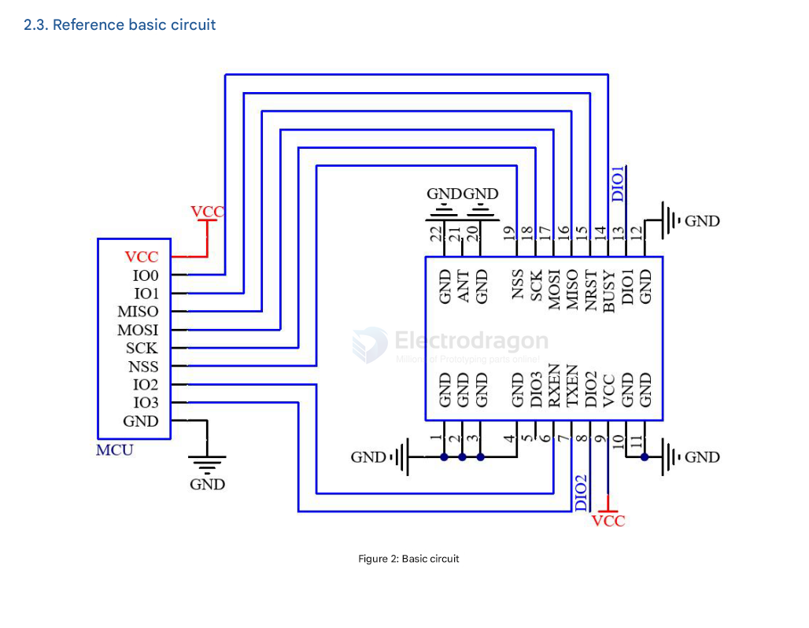

# SX1262-MD1-dat

## pin definitions 

Table 8: Module Pin Definition Description Table
| Pin Number             | Pin Name | Pin Function                                            | Description                                 |
| ---------------------- | -------- | ------------------------------------------------------- | ------------------------------------------- |
| 1,2,3,4,10,11,12,20,22 | GND      | Power Ground                                            |                                             |
| 5                      | DIO3     | Multi-function digital I/O - external TCXO power        | Input/Output                                |
| 6                      | RX       | Antenna switch                                          | Used to switch between receive and transmit |
| 7                      | TX       | Antenna switch                                          | Used to switch between receive and transmit |
| 8                      | DIO2     | Multi-purpose digital I/O / RF band switch control      | Input/Output                                |
| 9                      | vCC      | Power input pin                                         | 3.3V (Typical)                              |
| 13                     | DIO1     | Multi-purpose digital I/O                               | Input/Output                                |
| 14                     | BUSY     | Used for status indication                              |                                             |
| 15                     | RESET    | Reset pin                                               |                                             |
| 16                     | MISO     | SPI data output pin                                     |                                             |
| 17                     | MOSI     | SPI data input pin                                      |                                             |
| 18                     | SCK      | SPI clock input pin                                     |                                             |
| 19                     | NSS      | Module chip select pin, used to start SPI communication |                                             |
| 21                     | ANT      | RF interface                                            |                                             |

## Features 

- Output Power: +22dBm
- Maximum reception sensitivity: -125dBm (BW=125, SF=7)
- Line-of-sight distance in open areas can reach 8km (for reference only, the actual distance is subject to actual measurement)
- Module Parameters:
- Operating Voltage: 1.8V-3.7V (Typical: 3.3V)
- Supported operating frequency range: 850-930MHz
- External antenna
- Operating temperature: -40~+85°C
  
Note: The current module uses a non-temperature-compensated crystal oscillator. When the bandwidth is below 125K, it may cause excessive frequency deviation. If you need to use a bandwidth below 125K, please contact our business personnel for customization.

## basic circuits 

DIO1, DIO2, and DIO3 are general-purpose IO ports that can be configured for multiple functions;
Among them, DIO2 can be connected to TXEN, not to the MCU's IO port, to control the RF switch transmission. See the SX1262 manual for details. If not used, it can be left floating;

Differences between SX1262/SX1268 and LLCC68:

- SX1262/SX1268 support spreading factors SF5, SF6, SF7, SF8, SF9, SF10, SF11, SF12;
- LLCC68 supports spreading factors SF5, SF6, SF7, SF8, SF9, SF10, SF11.

## module hardware design note 

- It is recommended to use a DC regulated power supply to power the module. The power supply ripple coefficient should be as small as possible, and the module must be reliably grounded;
- Please pay attention to the correct connection of the positive and negative poles of the power supply. Reverse connection may cause permanent damage to the module;
- Please check the power supply to ensure it is within the recommended supply voltage range. Exceeding the maximum value will cause permanent damage to the module;
- Please check the stability of the power supply; the voltage should not fluctuate frequently and significantly;
- When designing the power supply circuit for the module, it is often recommended to reserve a margin of more than 30%, which is conducive to the long-term stable operation of the whole machine;
- The module should be kept as far away as possible from parts with large electromagnetic interference, such as power supplies, transformers, and high-frequency traces;
- High-frequency digital traces, high-frequency analog traces, and power traces must be routed away from the underside of the module. If it is absolutely necessary to route under the module, assuming the module is soldered on the TopLayer, a ground copper pour (fully poured and well-grounded) must be placed on the TopLayer in the contact area, close to the digital part of the module, and traces should be routed on the BottomLayer;
- Assuming the module is soldered or placed on the TopLayer, it is also wrong to route traces arbitrarily on the BottomLayer or other layers, as it will affect the module's spurs and receiving sensitivity to varying degrees;
- If there are devices with strong electromagnetic interference around the module, it will also greatly affect the module's performance. It is recommended to keep a suitable distance from the module according to the intensity of the interference. If conditions permit, appropriate isolation and shielding can be done;
- If there are traces with strong electromagnetic interference (high-frequency digital, high-frequency analog, power traces) around the module, it will also greatly affect the module's performance. It is recommended to keep a suitable distance from the module according to the intensity of the interference. If conditions permit, appropriate isolation and shielding can be done;
- If the communication line uses a 5V level, a 1k-5.1k resistor must be connected in series (not recommended, there is still a risk of damage);
- Try to stay away from physical layer protocols that are also 2.4GHz, such as USB3.0;
- The antenna installation structure has a great impact on the module's performance. Be sure to keep the antenna exposed, preferably vertically upwards. When the module is installed inside a case, a high-quality antenna extension cable can be used to extend the antenna to the outside of the case;
- The antenna must not be installed inside a metal case, as this will greatly reduce the transmission distance;
- It is recommended to add a 200R protection resistor to the RXD/TXD of the external MCU.