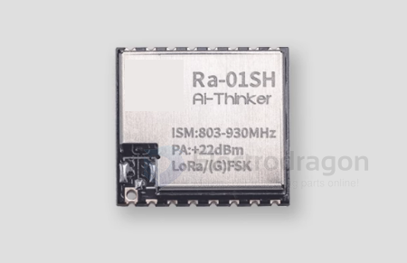
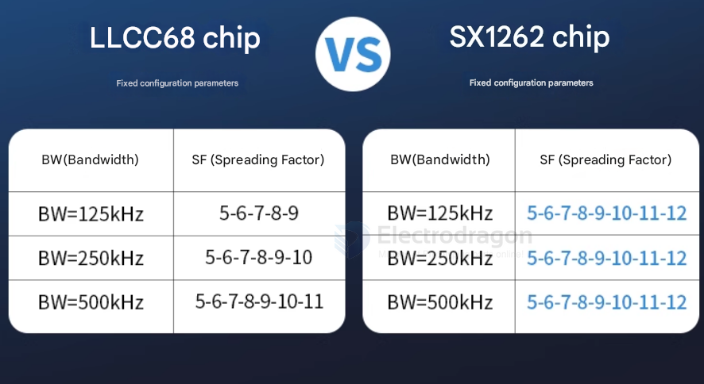
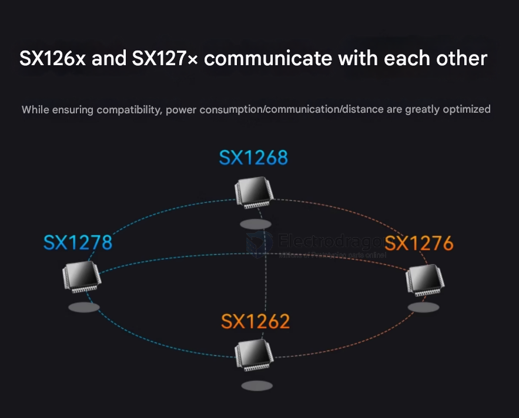
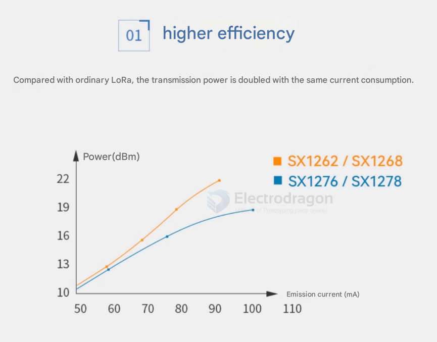

# SX1262-dat

- [[lora-dat]] - [[semtech-dat]]

## SX1262 Main Features

- [[LoRa-dat]]® and [[FSK-dat]] modulation
- 150 MHz to 960 MHz frequency range
- High sensitivity: down to -148 dBm
- +22 dBm maximum transmit power
- Low current consumption: 4.2 mA RX, 28 mA TX @ +14 dBm
- Integrated TCXO == [[crystal-dat]]
- Small size: 4x4 mm QFN package
- Suitable for long-range IoT applications
- Compliant with LoRaWAN® and IEEE 802.15.4g standards
- Automatic Frequency Control (AFC)
- Time-of-Flight (ToF) capabilities
- Built-in antenna switch
- Digital RSSI == [[RSSI-dat]]
- Packet engine to perform CRC, FEC, whitening, and address filtering

## SX1262 VS LLCC68 

- [[LLCC68-dat]]

## SX1262 vs SX1278 Comparison

- [[SX1278-dat]]

| Feature                       | SX1262                                         | SX1278                                   |
| ----------------------------- | ---------------------------------------------- | ---------------------------------------- |
| **Frequency Range**           | 150 MHz to 960 MHz                             | 137 MHz to 525 MHz                       |
| **Modulation**                | LoRa®, FSK                                     | LoRa®, FSK, OOK                          |
| **Max. TX Power**             | +22 dBm                                        | +20 dBm                                  |
| **RX Sensitivity**            | Down to -148 dBm                               | Down to -139 dBm                         |
| **Current Consumption (RX)**  | 4.2 mA                                         | 10.5 mA                                  |
| **Current Consumption (TX)**  | 28 mA @ +14 dBm                                | 120 mA @ +20 dBm                         |
| **TCXO Integration**          | Integrated                                     | External                                 |
| **Package**                   | 4x4 mm QFN                                     | 6x6 mm QFN                               |
| **LoRaWAN Compliance**        | Yes                                            | Yes                                      |
| **IEEE 802.15.4g Compliance** | Yes                                            | No                                       |
| **Typical Applications**      | Long-range IoT, asset tracking, smart metering | Wireless sensor networks, remote control |

**Summary:**

*   The **SX1262** generally offers better performance in terms of power consumption, sensitivity, and size, and supports a wider frequency range and IEEE 802.15.4g. It's a newer generation chip.
*   The **SX1278** is an older, more established chip that is still suitable for many LoRa applications, particularly where cost is a primary concern and the advanced features of the SX1262 are not required.
*   

## ref 

- [[semtech-dat]] - [[semtech]] - [[lora-dat]]

- [[STM32-dat]]

- [[SX1262]]