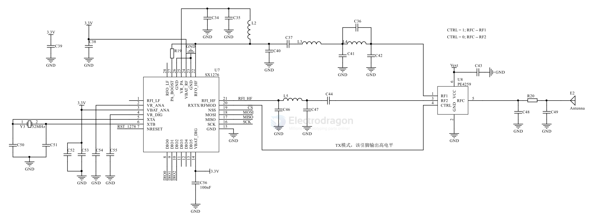

# SX1278-dat

- [[lora-dat]] - [[semtech-dat]]

- [[lora-chip-dat]] - [[lora-modules-dat]] - [[lora-dat]] 

## board 

- [[DAS1069-dat]] 

- [[NWL1078-dat]] - [[NWL1079-dat]] - [[NWL1080-dat]] - [[NWL1081-dat]]

- [[NWL1071-dat]] - [[NWL1072-dat]]

- [[NWL1074-dat]] - [[NWL1075-dat]] - [[NWL1077-dat]]

## SX1278 vs SX1276 Comparison

| Feature                     | SX1278                                      | SX1276                                      |
|-----------------------------|---------------------------------------------|---------------------------------------------|
| **Frequency Range**         | 137 MHz to 525 MHz                          | 137 MHz to 525 MHz                          |
| **Modulation**              | LoRa®, FSK, OOK                             | LoRa®, FSK, OOK                             |
| **Max. TX Power**           | +20 dBm                                     | +20 dBm                                     |
| **RX Sensitivity**          | Down to -139 dBm                             | Down to -139 dBm                             |
| **LoRa Spreading Factor**   | SF6 to SF12                                 | SF6 to SF12                                 |
| **Data Rate (LoRa)**        | Up to 37.5 kbps                             | Up to 37.5 kbps                             |
| **Data Rate (FSK)**         | Up to 300 kbps                              | Up to 300 kbps                              |
| **Supply Voltage**          | 1.8V to 3.7V                                | 1.8V to 3.7V                                |
| **Current Consumption (RX)**| 10.5 mA                                     | 10.5 mA                                     |
| **Current Consumption (TX)**| 120 mA @ +20 dBm                             | 120 mA @ +20 dBm                             |
| **Package**                 | 6x6 mm QFN                                  | 6x6 mm QFN                                  |
| **Key Features**            | Long Range, Low Power                        | Long Range, Low Power                        |
| **Typical Use**             | Wireless sensor networks, remote control     | Wireless sensor networks, remote control     |

**Summary:**

The SX1278 and SX1276 are very similar LoRa transceivers. In most applications, they are functionally interchangeable. Any differences are usually minor and related to specific manufacturing revisions or slight variations in performance characteristics that are not typically significant in most use cases.

## SCH 

- [[PE4259-dat]] - [[switch-dat]]

## ref 

- [[semtech-dat]]