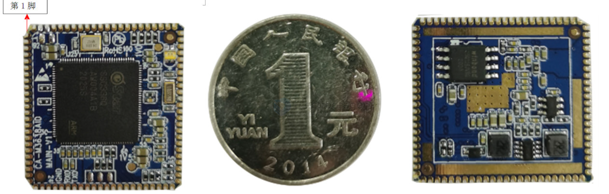

# Sigmastar-dat

- SSC337

- SSC336D 

SSD201/SSD202D 

There’s very limited public information about the chips, at least in English. The Linux SDK and DLA SDK can be acquired from SigmaStar after signing an NDA. 

some SSC33x modules and expensive development boards, but SigmaStar SS336D/SSD336Q camera SoC itself can also be purchased on Taobao for 49.5 RMB (about $7.6 US), while an SSC338Q module is offered for 108 RMB (~$17.6 US).

### SigmaStar SSC33x SoC Comparison

| Processor | Cores | Embedded memory | Camera support | AI accelerator | Process node | Compatible HiSilicon SoC |
|---|---|---:|---|---:|---:|---|
| SSC333 | Cortex-A7 | 512 Mbit | 1080p30, 3MP @ 20 fps | No | 28 nm | Hi3518EV300 |
| SSC335 | Cortex-A7 | 512 Mbit | 3MP @ 30 fps | No | 28 nm | Hi3518EV200 |
| SSC333D | Cortex-A7 | 1 Gbit | 1080p30, 3MP @ 20 fps | No | 28 nm | — |
| SSC335D | Cortex-A7 | 1 Gbit | 3MP @ 30 fps | No | 28 nm | — |
| SSC337D | Cortex-A7 | 1 Gbit | 1080p60, 5MP @ 20 fps | No | 28 nm | Hi3516EV300 |
| SSC336D | 2× Cortex-A7 | 1 Gbit | 3MP @ 30 fps | 0.5 TOPS | 22 nm | Hi3516CV500 |
| SSC336Q | 2× Cortex-A7 | 2 Gbit | 3MP @ 30 fps | 0.5 TOPS | 22 nm | Hi3516CV500 |
| SSC338Q | 2× Cortex-A7 (TBC) | 2 Gbit | 4K @ 20 fps | 0.5 TOPS | 22 nm | Hi3516DV300 |
| SSC338G | 2× Cortex-A7 (TBC) | — | 4K @ 20 fps | 1 TOPS | 22 nm | Hi3516DV300 |
| SSC339G | 2× Cortex-A7 (TBC) | — | 4K @ 30 fps | 1 TOPS | 22 nm | — |

[SigmaStar SSC33x Camera SoCs are pin-to-pin compatible with Hisilicon Hi3516/Hi3518 processors](https://www.cnx-software.com/2021/05/05/sigmastar-ssc33x-camera-soc-pin-to-pin-compatible-hisilicon-hi3516-hi3518/)

## ref 

