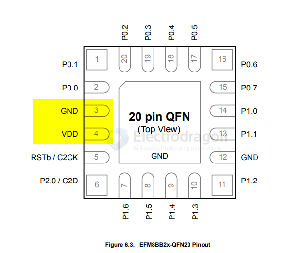
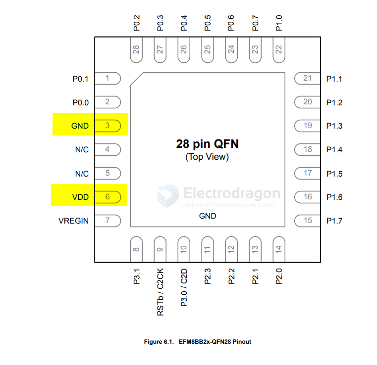

# EFM8-dat

- [[EFM8-dat]] - [[MCU-dat]] - [[silicon-labs-dat]]

## tech 

- [[USB-SDK-dat]]

## info EFM8 UB1 0

- [[USB-SDK-dat]]

https://www.silabs.com/mcu/8-bit-microcontrollers/efm8-universal-bee/device.efm8ub10f16g-qfn20?tab=specs

EFM8UB10F16G-QFN20

EFM8 USB Capable Universal Bee 8-bit Microcontrollers (MCUs)

The USB capable EFM8UB10F16G-QFN20 8-bit MCUs are built on top of a low power platform this device operates at 48 MHz. In addition to USB support, the EFM8UB10F16G-QFN20 includes 16 kB Flash, 2 kB RAM, 13 Dig I/O Pins, 5 x 16-bit timers, 3 PCA Channels, and additional communication peripherals.

## info EFM8 BB2 1 

EFM8BB21F16G-QFN20

EFM8 Busy Bee 8-bit Microcontrollers (MCUs)

https://www.silabs.com/documents/public/data-sheets/efm8bb2-datasheet.pdf

## marking 

## footprint 

QFN20

BB21 F16G

## use 

- [[X12-dat]]

## ref 