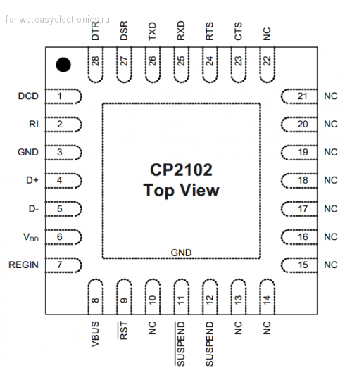
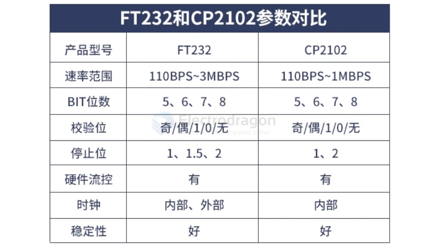
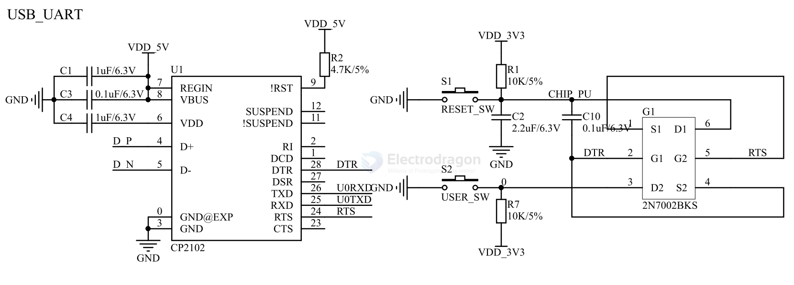

# CP2102 dat 

driver 

- http://www.electrodragon.com/wp-content/uploads/2012/01/cp210x.rar - 404 

https://www.silabs.com/developer-tools/usb-to-uart-bridge-vcp-drivers?tab=downloads

- datasheet == [[cp2102-datasheet.pdf]]

## boards 

- [[dpr1003-dat]] - [[DPR1005-dat]] - [[cp2102-dat]]

- [[CP2102N-dat]]

## CP2102 VS FT232RL 

## SCH 

2x mosfet == 2N7002

- [[dual-mosfet-dat]] - [[mosfet-dat]]

## alternative 

- [[WCH-dat]]

## ref 

- [[serial-dat]]