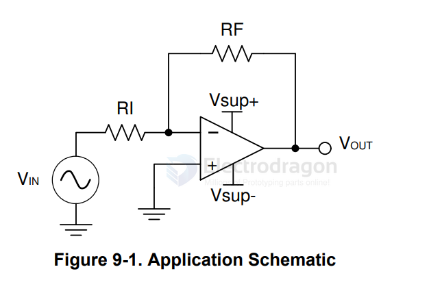
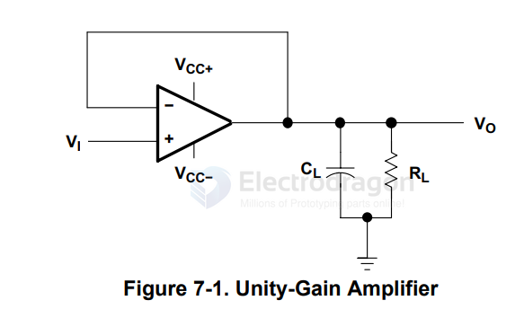
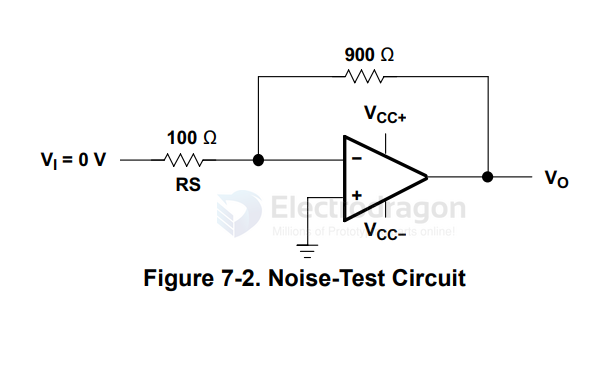

# LM324-dat

- [[EDA-simulation-dat]]

LMx24, LMx24x, LMx24xx, LM2902, LM2902x, LM2902xx, LM2902xxx Quadruple Operational Amplifiers

LM2902M - IC QUAD OPERATIONAL AMP(14SOP)

- [[amplifier-dat]]

## Info 

chip info, [datasheet](https://www.ti.com/lit/ds/symlink/lm324.pdf?ts=1761973239066), etc.

## App. 

- [[op-amp-dat]]

### Typical Application

A common application for an operational amplifier is an inverting amplifier. This amplifier takes a positive voltage on the input, and produces a negative voltage with the same magnitude. 

In the same manner, the amplifier also makes negative voltages positive. A linear gain can be achieved by changing the resistor ratio in the feedback path.

###  Unity-Gain Amplifier

### Noise-Test Circuit

## ref 

- [[LM-series-dat]] 
