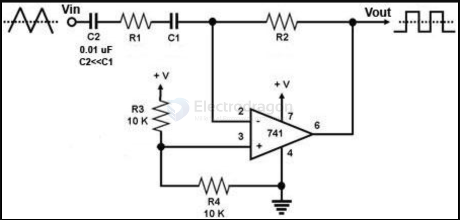

# LM358 DAT 

- [[amplifier-dat]]

## boards 

- [[MSP1023-dat]]

## datasheet 

Single Supply Dual Operational Amplifiers - LM258, LM358, LM358A, LM358E, LM2904, LM2904A, LM2904E, LM2904V, NCV2904

[LMx58-N Low-Power, Dual-Operational Amplifiers](https://www.ti.com/lit/ds/snosbt3j/snosbt3j.pdf?ts=1688712730211&ref_url=https%253A%252F%252Fwww.google.com%252F)

https://www.onsemi.com/download/data-sheet/pdf/lm358-d.pdf

## What is LM358 used for?

Because of its efficiency and versatility, the LM358 is a low-power dual-operational amplifier integrated circuit that is widely employed in a variety of electronic applications. The following are the LM358's main applications:

Signal Amplification: The LM358 may amplify signals from a variety of sources, including sensors and transducers, by being utilized to build inverting, non-inverting, and differential amplifiers.

Comparators: It can be used as a comparator to determine which of two input signals is greater by comparing them and producing a high or low output. Applications such as signal conditioning and level detection can benefit from this.

Active Filters: The LM358 is used to create active filters that are appropriate for audio and signal processing applications. These filters have the ability to filter or amplify particular frequencies from a signal.

Voltage Followers: Having a high input impedance and a low output impedance, it functions as a voltage follower or buffer amplifier to keep the input and output voltages constant.

Circuits for integrators and differentiators: The LM358 can be set up to carry out signal integration and differentiation, which are crucial operations in analog computing and signal processing.

Transducer amplifiers: These devices are frequently used to boost transducer signals, which are usually low-level outputs that require amplification before being processed further.

Summing Amplifiers: The LM358 is a helpful device in applications where it is necessary to combine numerous signals since it can add multiple input signals together.

In general, the versatility and low power consumption of the LM358 make it an indispensable component for electronic designs for both hobbyists and professionals.

## Basic 

non-inverting voltage reference

Same for LMV321 

## LM358 Equivalents

Depending on the particular needs of the application, a number of comparable or different parts can be utilized in lieu of the LM358 operational amplifier. Here are a few noteworthy analogs:

| IC Chips       | Description                                                                   | Advantages as LM358 Equivalent                                                                      |
| -------------- | ----------------------------------------------------------------------------- | --------------------------------------------------------------------------------------------------- |
| LM324          | A quad operational amplifier with four op-amps in one package.                | Cheaper per op-amp than the LM358, suitable for applications requiring multiple amplifiers.         |
| LM2904         | A dual op-amp similar to the LM358 but tested under less rigorous conditions. | Cost-effective alternative, good for applications where stringent specifications are not critical.  |
| TL072          | A low-noise JFET-input operational amplifier.                                 | Higher input impedance and lower noise, are suitable for audio applications.                        |
| NE5532         | A high-performance dual op-amp designed for audio applications.               | Better performance in terms of noise and distortion, ideal for high-fidelity audio circuits.        |
| MCP600x Series | A family of low-power rail-to-rail op-amps.                                   | Suitable for battery-powered applications due to low power consumption and single supply operation. |
| JRC4558        | A dual op-amp is often used in audio applications.                            | Known for good sound quality, it is popular in guitar pedals and other audio equipment.             |
| LP358          | A dual op-amp with similar specifications to the LM358.                       | Offers rail-to-rail output and is suitable for low-voltage applications.                            |

## simulation 

https://www.ti.com/product/LM358#design-tools-simulation

download official model - Simulation model

[LMx58_LM2904 PSpice Model (Rev. C)](https://www.ti.com/lit/zip/snom268)

SNOM268C.ZIP (23 KB) - PSpice Model

input 5V, output 10V, gain = 2x 

https://www.circuitlab.com/editor/#?id=4x4jmf

### LM358 Kicad Simulation 

doAnalyses: TRAN:  Timestep too small; initial timepoint: trouble with xu1.xi_nn:dvnf-instance d.xu1.xi_nn.d1
run simulation(s) aborted

- this maybe a common issue to [[LM358-dat]], use another [[amplifier-dat]]

## LM358 Common-Mode Input Voltage Range

Single Supply Opamp has only one supply rail (+VCC) to an opamp for which your applied signal will be amplified or swing only in between the +VCC and GND.Therefore, your output voltage has a swing in between +VCC and GND rails.

Dual Supply opamp has two supply rails with reference to GND to an opamp i.e +VCC and -VCC rails.Your applied voltage can swing between these two voltage levels.Hence, the output signal can swing only between these voltage(+VCC and -VCC) limits and they cannot exceed above these levels.

For example, in an audio signal amplification, the input audio signal(Voice) can swing between +ve and -ve voltage levels(usually in mV). So this input signal can be amplified to +12V(+VCC) and -12V(-VCC) if your apply the +VCC=12V and -VCC=-12V.

#### **Single-Supply Operation (e.g., 0V to 5V)**
- **CMVR:** 0V to (Vcc - 1.5V)
- Example: If **Vcc = 5V**, input range is **0V to 3.5V**.

#### **Dual-Supply Operation (e.g., ±5V)**
- **CMVR:** (V−) to (V+ - 1.5V)
- Example: If **Vcc = ±5V**, input range is **-5V to +3.5V**.

#### **Key Considerations**
- **Input must stay within CMVR** for proper operation.
- **Exceeding CMVR** may cause distortion or incorrect behavior.
- **LM358 supports input down to ground** (0V) in single-supply mode.

## App

### general 

- solar detector
- solar voltage at 2.6-2.8V, output 3.5V 

### mic pre-amp 

**The gain is -R5/R2** only when the gain is defined as the output voltage divided by the voltage at the R2/C1 junction. 

The gain from the source -- the MIC -- on the other side of C1 is influenced by the impedance of C1. 

compared to 20kHz, at 1.6kHz the gain has fallen to ~70% x (-R5/R2).

### Heart Pulse Sensor Circuit Using Opamp (LM358)

### Test Circuit With Class-A Operation

### LM358 for Shock Alarm Circuit:
A shock alarm circuit similar to the one below can be found in both homes and cars. Its major use is as an anti-theft alarm in autos. The shock sensor in this circuit is a piezoelectric sensor, which needs to be mounted on the door you wish to protect. The LM358 is attached in this instance as an inverting Schmitt trigger. Port 1 can set the circuit's threshold voltage, and resistor R1 serves as a feedback resistor.

The piezo sensor will have a low output when it is not active. The buzzer is activated when the Schmitt trigger is triggered by the piezo sensor's high output. It takes some time for the buzzer to stop beeping even if the vibration is disconnected. This happens because the state is difficult to invert and the inverting input, as it grows, has less of an impact once the LM358 IC is turned on.

### LM358 for Square Wave Generator:

### LM358 based comparator uses single supply

### negative output 

### Inverting Amplifier

### Non-Inverting Amplifier

### Op-Amp Differentiator

## read more 

- For a single-supply inverting op amp (in this case 9V), [resistor connecting input to virtual ground](https://www.reddit.com/r/AskElectronics/comments/rmeyj0/for_a_singlesupply_inverting_op_amp_in_this_case/)

- [LM358 Op-Amp Integrator Circuit Analysis with single and dual power supply](https://www.ee-diary.com/2021/11/lm358-op-amp-integrator-circuit.html)

## ref 

- [[amplifier-dat]]

- [[multisim-dat]] - [[EDA-simulation-dat]]

[[LM358]]
