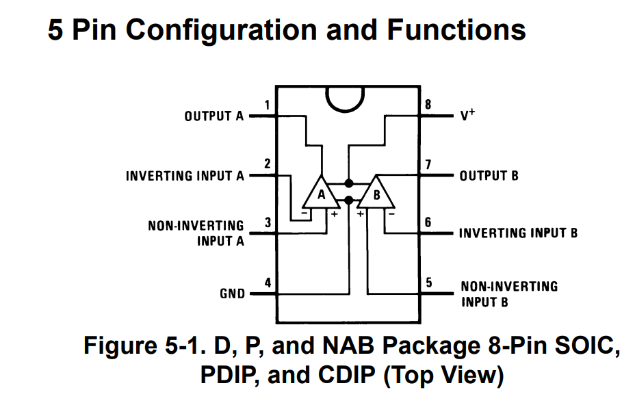

# LM358 DAT 

## boards 

- [[MSP1023-dat]]

## datasheet 

[LMx58-N Low-Power, Dual-Operational Amplifiers](https://www.ti.com/lit/ds/snosbt3j/snosbt3j.pdf?ts=1688712730211&ref_url=https%253A%252F%252Fwww.google.com%252F)

https://www.onsemi.com/download/data-sheet/pdf/lm358-d.pdf

## Basic 

non-inverting voltage reference

## simulation 

https://www.ti.com/product/LM358#design-tools-simulation

download official model - Simulation model

[LMx58_LM2904 PSpice Model (Rev. C)](https://www.ti.com/lit/zip/snom268)

SNOM268C.ZIP (23 KB) - PSpice Model

input 5V, output 10V, gain = 2x 

https://www.circuitlab.com/editor/#?id=4x4jmf

## LM358 Kicad Simulation 

## LM358 Common-Mode Input Voltage Range

#### **Single-Supply Operation (e.g., 0V to 5V)**
- **CMVR:** 0V to (Vcc - 1.5V)
- Example: If **Vcc = 5V**, input range is **0V to 3.5V**.

#### **Dual-Supply Operation (e.g., ±5V)**
- **CMVR:** (V−) to (V+ - 1.5V)
- Example: If **Vcc = ±5V**, input range is **-5V to +3.5V**.

#### **Key Considerations**
- **Input must stay within CMVR** for proper operation.
- **Exceeding CMVR** may cause distortion or incorrect behavior.
- **LM358 supports input down to ground** (0V) in single-supply mode.

## App

- solar detector
- solar voltage at 2.6-2.8V, output 3.5V 

## ref 

[[LM358]]
