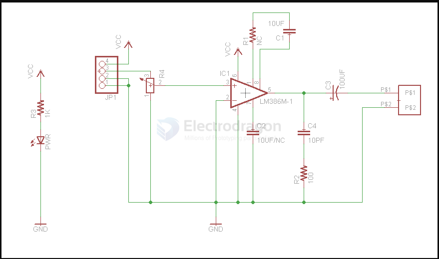
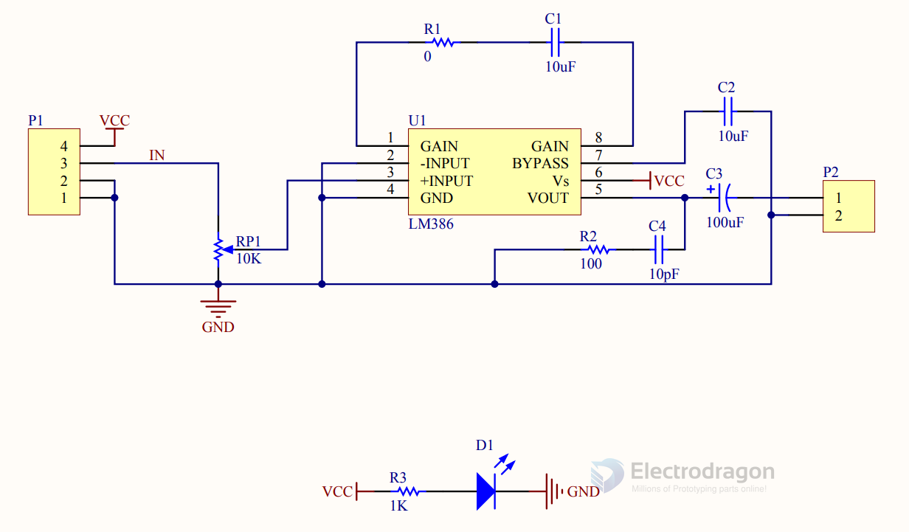
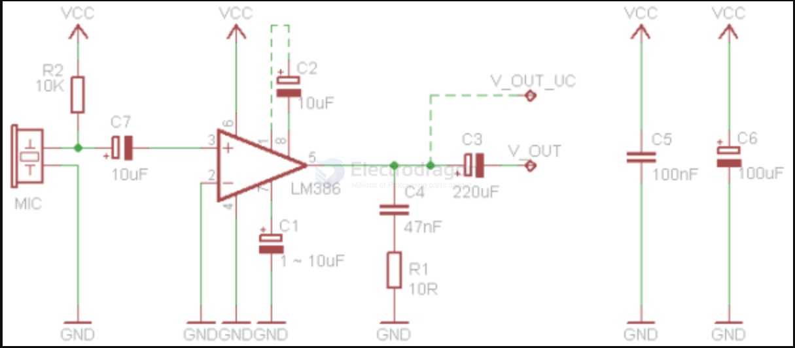

# LM386-dat

legacy wiki page - https://w.electrodragon.com/w/LM386

## SCH 

| gain | R4/RPI1 (pot-trim) | R1   | C1   | C2   |
| ---- | ------------------ | ---- | ---- | ---- |
| 10x  | 10K                | -    | -    | -    |
| 14x  | 5K                 | -    | -    | -    |
| 20x  | 2K                 | -    | -    | -    |
| 50x  |                    | 1.2K | 10uF | 10UF |
| 100x |                    | ?    | 10uF | 10UF |
| 200x |                    | 0    | 10uF | 10UF |

LM386 with microphone, Amplification is controlled by R2 in schematic 2

| BOM | value   | explain                                        |
| --- | ------- | ---------------------------------------------- |
| C1  | 1~10uF  | Bypass capacitor                               |
| C2  | 10uF    | Gain 200x. Optional, without 10uf is 20x gain. |
| C3  | 220uF   | Output coupling capacitor                      |
| C4  | 47nF    | Boucherot cell                                 |
| C5  | 100nF   | Power supply decoupling                        |
| C6  | 100uF   | Power supply decoupling                        |
| C7  | 10uF    | Microphone coupling capacitor                  |
| MIC |         | Electret microphone                            |
| R1  | 10R     | Boucherot cell                                 |
| R2  | 1 ~ 10K | Microphone load resistor                       |
| VSS | 4 ~ 12V | Supply voltage                                 |

## demo code 

Only generate very simple sound for testing.

    #define SOUNDOUT_PIN 9

    void setup(void){
    //Set the sound out pin to output mode
    pinMode(SOUNDOUT_PIN,OUTPUT);
    }

    void loop(void){
    //Generate sound by toggling the I/O pin High and Low
    //Generate a 1KHz tone. set the pin high for 500uS then
    //low for 500uS to make the period 1ms or 1KHz.

    //Set the pin high and delay for 1/2 a cycle of 1KHz, 500uS.
    digitalWrite(SOUNDOUT_PIN,HIGH);
    delayMicroseconds(500);

    //Set the pin low and delay for 1/2 a cycle of 1KHz, 500uS.
    digitalWrite(SOUNDOUT_PIN,LOW);
    delayMicroseconds(500);
    }

## online simulation

- https://www.circuitlab.com/circuit/hcqmtsvrz7mw/lm386/
- https://www.circuitlab.com/browse/by-tag/lm386/

## demo 

https://www.youtube.com/watch?v=Q6ArZWTh-w0&ab_channel=Electrodragon

## ref 

- [[EDA-simulation-dat]]

- [[LM386]]