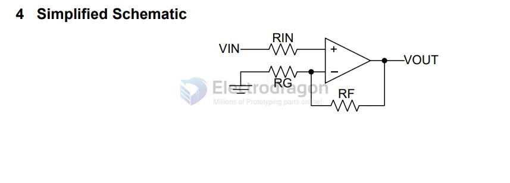
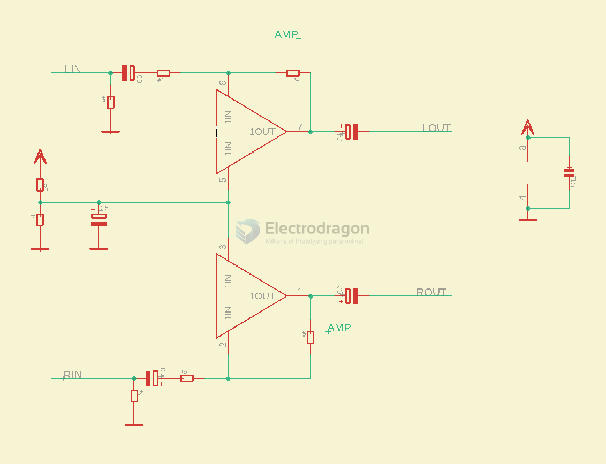

# NE5532-dat

DS - https://www.ti.com/lit/ds/symlink/ne5532.pdf

NE5532x, SA5532x Dual Low-Noise Operational Amplifiers

## boards 

- [[AMP1017-dat]]

## appliction amplifier 

VCC+ Supply voltage: 5 ~ 15 V

d

## audio amplifier SCH 

## ref

- [[TI-dat]]