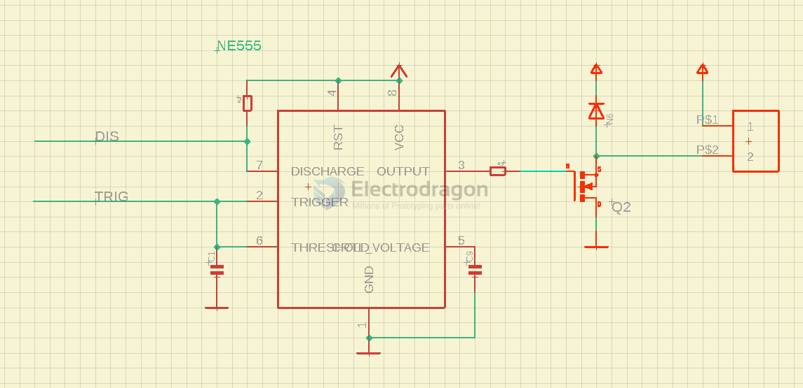

# NE555-DAT

partner: [[LM317-dat]]

[[6102350-dat]] == [[NE555-dat]]

## Boards 

- [[SCU1044-dat]]

- [[MSP1017-dat]]

## Function  

The NE555 timer IC can generate:

- Delays (timing circuits)
- Square waves (oscillators)
- PWM signals
- One-shot pulses (monostable mode)

## It operates in three modes:

| Mode       | Use Case       | Description                                     |
| ---------- | -------------- | ----------------------------------------------- |
| Monostable | One-shot pulse | Output goes high for a fixed time after trigger |
| Astable    | Oscillator     | Continuously generates square wave pulses       |
| Bistable   | Flip-flop      | Toggles output on each trigger                  |

- [[NE555-monostable-dat]]

- [[NE555-Astable-dat]]

## info 

        +---+--+---+
    1 | GND     VCC | 8
    2 | TRIG   DIS  | 7
    3 | OUT     THR | 6
    4 | RESET  CTRL | 5
        +----------+

| Pin | Name  | Function                                          |
| --- | ----- | ------------------------------------------------- |
| 1   | GND   | Ground (0V)                                       |
| 2   | TRIG  | Trigger input (active low)                        |
| 3   | OUT   | Output                                            |
| 4   | RESET | Reset (active low, connect to VCC)                |
| 5   | CTRL  | Control voltage (optional, add 0.01µF cap to GND) |
| 6   | THR   | Threshold (used in timing)                        |
| 7   | DIS   | Discharge (used in timing)                        |
| 8   | VCC   | Power (4.5V to 15V)                               |

- input voltage up to 12 (16)V

datasheet == https://www.ti.com/lit/ds/symlink/ne555.pdf

T = 1.1C = 1.1 * 500 000 * 0.000047 = 25.85 seconds 

## ⚙️ Mode 3: Bistable (Flip-Flop)

### 🔁 Toggle output on/off with triggers

### 🔧 Basic Wiring:

- Trigger button to **Pin 2**
- Reset button to **Pin 4**
- Output toggles high/low

---

## ⚡ Applications

| Application                  | Example Use                      |
| ---------------------------- | -------------------------------- |
| Timer                        | Delay off circuits               |
| Oscillator                   | LED flasher, tone generator      |
| Pulse Width Modulation (PWM) | Brightness/motor speed control   |
| Bistable Switch              | Toggle button circuit            |
| Frequency Generator          | Clock signals for logic circuits |

## 📘 Example: LED Flasher Circuit (Astable Mode)

    VCC (+)
    |
    [R1]
    |
    +-------+
    |       |
    [R2]    Pin 7
    |       |
    [C1]     |
    |       |
    GND     Pin 6
            |
            Pin 2
            |
            GND

    Pin 3 (OUT) → LED + resistor → GND

## tuning pulse 

- used on board [[SCU1063-dat]]

- output control by [[D4184-dat]] [[mosfet-dat]]

## ref 

- http://www.sparkfun.com/datasheets/Components/General/ne555.pdf

- [[pulse-generator-dat]]