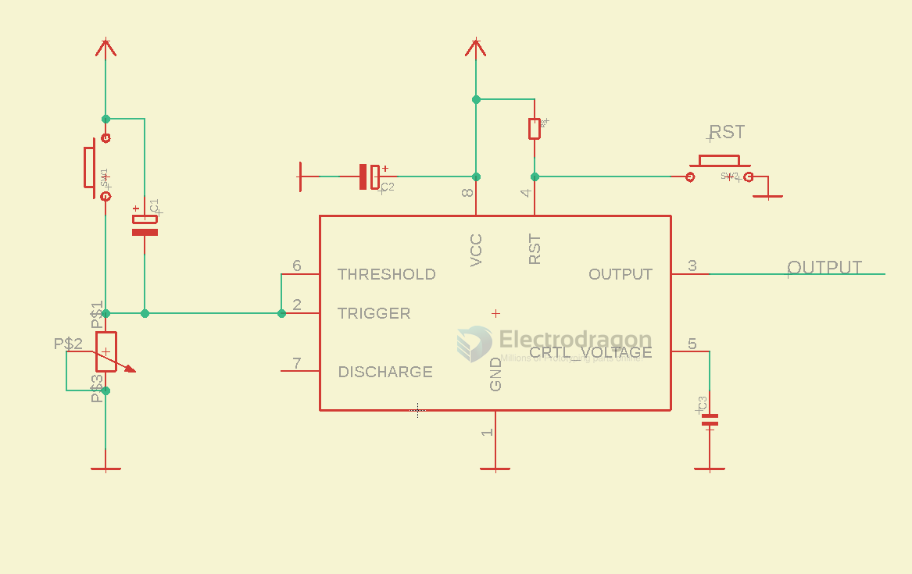

# NE555-monostable-dat


## ⚙️ Mode 2: Monostable (One-shot Pulse)

### example 1. 🔁 Triggered pulse of fixed length

#### 🔧 Wiring:

```
 VCC
  |
 [R1]
  |
 Pin 7 (DIS)
   |
  Pin 6 (THR) ------+
                   |
                  [C1]
                   |
                  GND

- Button → Pin 2 (TRIG), pulled up to VCC
- Pin 4 (RESET) → VCC
- Pin 5 (CTRL) → 0.01µF to GND
- Pin 3 = Output
```

#### 🧮 Pulse Time:

```
T = 1.1 × R1 × C1
```

---


### example 2. 🧠 Circuit Function: Monostable Pulse Generator (One-Shot Timer)




#### 🔍 What it does:
- When the button is pressed (SW1), the circuit triggers the **555 timer** to generate a **single output pulse**.
- The **duration** of the pulse is set by the resistor PS1 (a potentiometer) and capacitor C1.
- The output pin (pin 3) goes **high (ON)** for a fixed time, then returns low automatically.

---

#### 🔁 How it Works (Step-by-step)

1. **Initial state**:
   - The 555 timer waits for a **low signal** on the **Trigger (pin 2)**.
   - The output (pin 3) is normally **LOW**.

2. **Trigger event**:
   - When SW1 is pressed, the capacitor C1 pulls the **Trigger pin (2)** low.
   - This **activates** the 555 timer.

3. **Timing begins**:
   - Output (pin 3) goes **HIGH** immediately.
   - The capacitor C1 starts charging through the potentiometer (PS1).

4. **Pulse duration**:
   - The high output duration `T` is determined by:
     ```
     T = 1.1 × R × C
     Where:
       R = resistance of PS1 (in ohms)
       C = capacitance of C1 (in farads)
     ```
     In your case:
     - PS1: adjustable potentiometer
     - C1: 47µF
     → So T is adjustable via the pot.

5. **End of timing**:
   - Once the capacitor reaches 2/3 of Vcc, the timer resets itself.
   - Output (pin 3) goes **LOW** again.

---

#### 🧩 Other Components:

| Component | Role                                         |
|-----------|----------------------------------------------|
| **C2**    | Power filter cap for stability               |
| **C3**    | Controls pin noise on control voltage (pin 5)|
| **PS2**   | Potentiometer for fine adjustment of trigger |
| **SW2**   | Reset switch → forces timer to stop          |

---

#### ✅ Typical Use Cases:

- Delay timer
- Pulse stretcher
- Debouncing a switch
- Timer for lights, relays, buzzers
- Generating single-shot triggers for digital logic