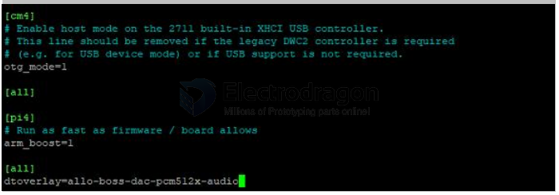
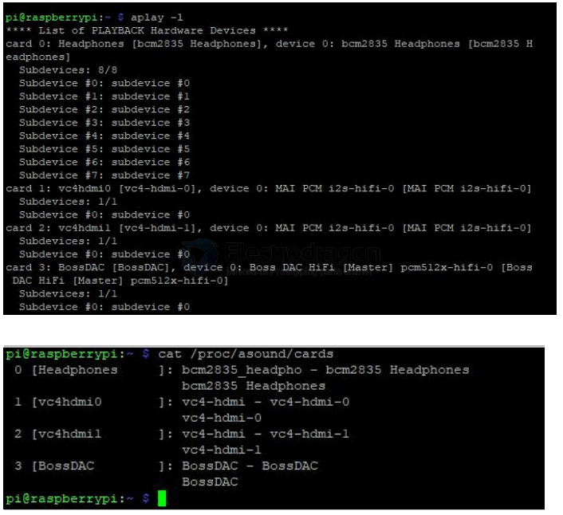

# PCM5122-RPI-dat.md

1) Modify the config.txt on termianl. Open the config.txt in system. 

    sudo nano /boot/config.txt

Append the following lines to the end of the file,enable the audio module.Draw attention to theformat , Otherwise it doesn't work. press "ctrl+o" and press "Enter" to save the file. Reboot thesystem. 

    dtoverlay=allo-boss-dac-pcm512x-audio

2)Check the DAC module

Type in the commands that are shown below. You can see the BossDAC, the 3 is the dac devicenumber. 

    aplay -l
    cat /proc/asound/cards

