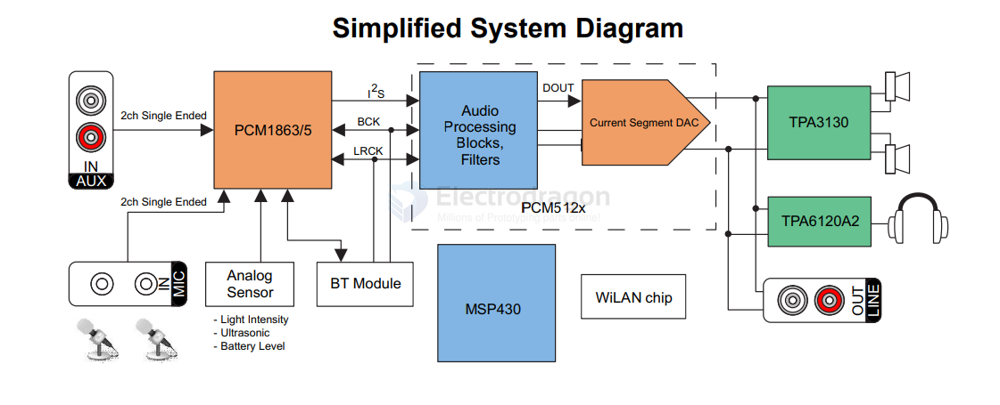
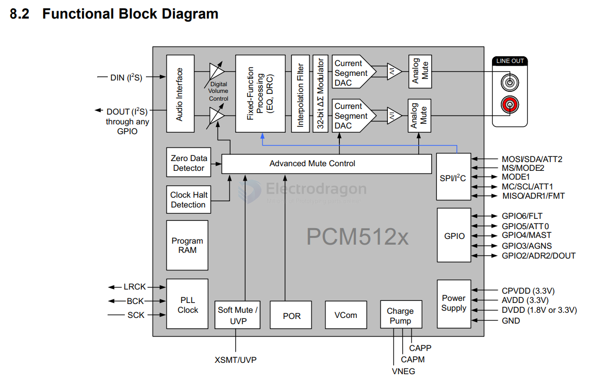

# PCM5122-dat

https://www.ti.com/lit/ds/symlink/pcm5122.pdf?ts=1733217884746&ref_url=https%253A%252F%252Fwww.google.com%252F

PCM512x 2-VRMS DirectPath™, 112-dB and 106-dB Audio Stereo DACsWith 32-Bit, 384-kHz PCM Interface

## About PCM5122

- Upgrade DAC chip, using BB (acquired by TI) More high-end PCM5122 chip,
    - Using I2S interface, not USB, control volume and audio via I2C interface.
    - Supports 16- to 32-bit audio data formats
    - Distortion and dynamic are very good,
    - Support high 384kHz sampling rate,
    - Dynamic range 112dB, Distortion -93Db.
    - Soft rising or falling ramp and analog squelch for 120dB squelch SNR with no pops.
- PCM5122 also integrates a negative charge pump, the output without DC blocking capacitors; 2.1Vrms ground center output; Very good ability to suppress out-of-band noise. By supporting loads as low as 1kΩ, the PCM510xA can drive multiple parallel products. (That is, more than one amplifier at the same time).
- The output ports are gold plated RCV double terminals and gold plated 3.5mm headphone holder
- Isolated power supply design, the raspberry pie power supply and DAC part of the independent power isolation, and mutual non-interference through the beads, get rid of the current sound
- Solderless, plug directly to the expansion board can be used, and the use of I2S interface directly decode digital to analog, non-USB DAC interface,
- Increase for the two-color led to provide status display, red light for the DAC power indicator (power is bright), green for the DAC work status lights (work decoding, light, stop or not work off), a better understanding of the work of the DAC
- Perfect compatible Raspberry Pi official PI HAT size, PCB board with high gold plating process, curved alignment (high-end HIFI DAC arc alignment), better signal continuity and reduce the signal reflection and refraction.

## Function Diagram 

- [[PCM1863-dat]] - [[TPA3130-dat]] - [[TPA6120-dat]] - [[MSP430-dat]]

- [[I2S-dat]]

- normally use the [[SPI-dat]] output 

## Board 

- [[MPC1083-dat]]

## ref 

