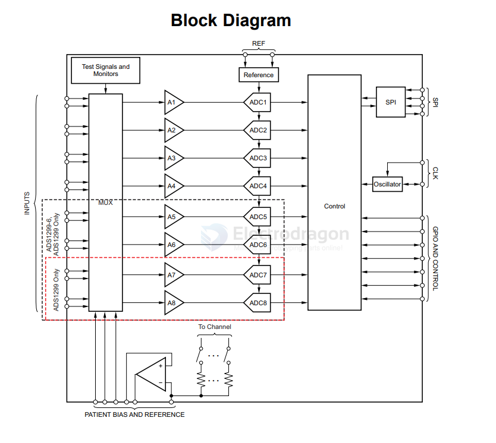
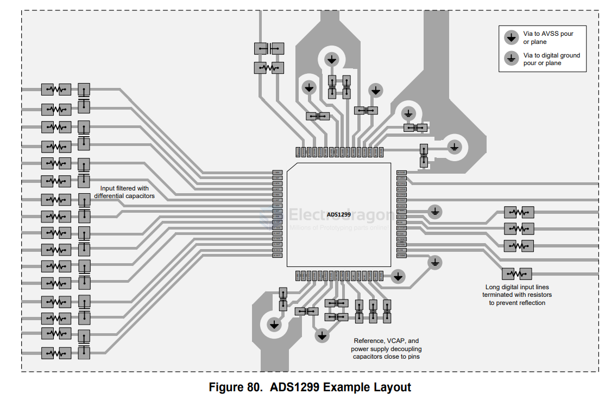

# TI-ADC-dat.md

- [[TI-ADC-dat]] - [[TI-dat]]

`ADS8326` 16-Bit, High-Speed, 2.7V to 5.5V microPower Sampling ANALOG-TO-DIGITAL CONVERTER

`ADS8320` 16-Bit, High-Speed, 2.7-V to 5-V microPower Sampling Analog-to-Digital Converter

`ADS7263SRHBT` - 14 Bit Analog to Digital Converter 4, 8 Input 2 SAR 32-VQFN (5x5)

ADSxxx3 Dual, 1-MSPS, 16-, 14-, and 12-Bit, 4×2 or 2×2 Channel, Simultaneous Sampling Analog-to-Digital Converter

## ADS1299IPAGR

`ADS1299IPAGR` == Low-Noise, 8-Channel, 24-Bit Analog-to-Digital Converter for Biopotential Measurements | PAG | 64 | -40 to 85

https://www.ti.com/lit/ds/symlink/ads1299.pdf

diagram 

## PCB 

## ref 

