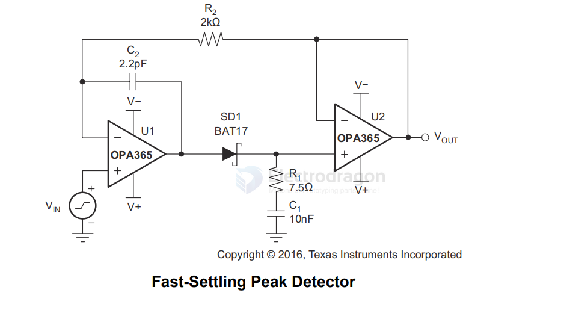

# TI-AMP-dat.md

- [[TI-AMP-dat]] - [[TI-audio-dat]]

## unsort 

LMC6482 / LMC6484 - LMC648x CMOS Rail-to-Rail Input and Output Operational Amplifiers

## OPA 

OPA317, OPA2317, OPA4317 - `OPAx317` Zerø-Drift, Low-Offset, Rail-to-Rail I/O Operational Amplifier Precision Catalog

`OPAx365` 50-MHz, Zerø-Crossover, Low-Distortion, High-CMRR, RRI/O, Single-Supply Operational Amplifiers

`OPA2188` == OPA2188 0.03-μV/°C Drift, Low-Noise, Rail-to-Rail Output, 36-V, Zero-Drift Operational Amplifiers

`OPA2197`

OPA189, OPA2189, OPA4189 - `OPAx189` Precision, Lowest-Noise, 36-V, Zero-Drift, 14-MHz, MUX-Friendly, Rail-to-Rail Output Operational Amplifiers

`OPA4188` - OPA4188 0.03-μV/°C Drift, Low-Noise, Rail-to-Rail Output, 36-V, Zero-Drift Operational Amplifiers

## TL 

- TL071CP

TL071,TL071A,TL071B,TL071H, TL072,TL072A,TL072B,TL072H,TL072M, TL074,TL074A,TL074B,TL074H,TL074M, SLOS080W-SEPTEMBER 1978-REVISEDJULY2025

`TL07xx` Low-Noise, FET-Input Operational Amplifiers

## ISO 

`ISO224` Reinforced Isolated Amplifier With Single-Ended Input of ±12 V and Differential Output of ±4 V

## THS 

`THS4503` - High-Speed Fully-Differential Amplifiers 

`THS4150IDGN` - Differential Amplifier 1 Circuit Differential 8-HVSSOP

## ref 

- [[TI-dat]]

- [[TI]]