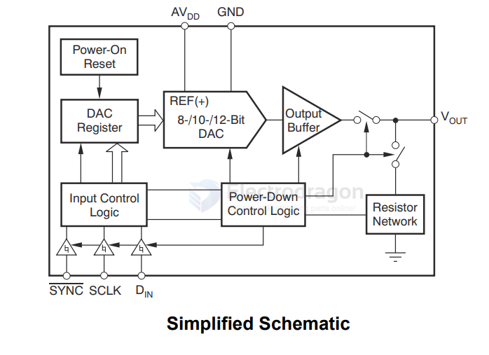

# TI-DAC-dat

- [[OPA211-dat]] - [[DAC5311-dat]] - [[TI-DAC-dat]] - [[DAC-dat]]

## DAC5311 

`DACx311` 2-V to 5.5-V, 80-µA, 8-Bit, 10-Bit, and 12-Bit, Low-Power, Single-Channel, Digital-to-Analog Converters in SC70 Package

SCH 

## ref 

