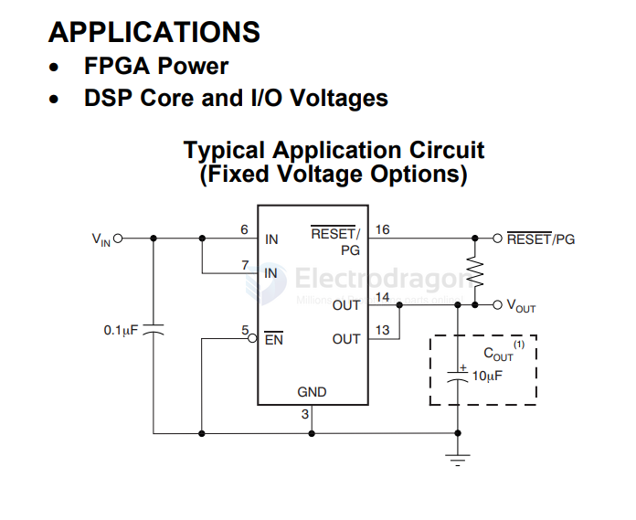
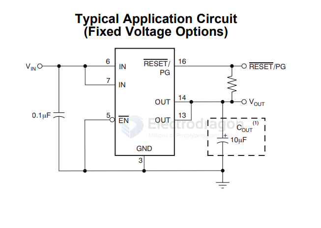

# TI-LDO-dat

- [[ti-power-dat]] - [[TI-power-dcdc-down-dat]] - [[ti-power-dcdc-boost-dat]] - [[ti-power-dcdc-boost-down-dat]] - [[TI-LDO-dat]]

- [[LDO-dat]] - [[TI-LDO-dat]] - [[TI-dat]]

TPS78225-Q1, TPS78227-Q1, TPS78228-Q1, 1TPS78230-Q1

150-mA, ULTRA-LOW QUIESCENT CURRENT, 1-μA IQ LOW-DROPOUT LINEAR REGULATOR

TLV431BCDBZTG4 - TLV431x Low-Voltage Adjustable Precision Shunt Regulator

## TPS77533D 

https://www.ti.com/lit/ds/symlink/tps775.pdf?ts=1788338780319

TPS775xx, TPS776xx == TPS775xx with RESET Output, TPS776xx with PG Output FAST-TRANSIENT-RESPONSE 500mA LOW-DROPOUT VOLTAGE REGULATORS

FEATURES
- Open Drain Power-On Reset with 200ms Delay(TPS775xx)
- Open Drain Power Good (TPS776xx)
- 500mA Low-Dropout Voltage RegulatorAvailable in Fixed Output and AdjustableVersions
- Dropout Voltage to 169mV (Typ) at 500mA(TPS77x33)
- Ultralow 85μA Typical Quiescent Current
- Fast Transient Response
- 2% Tolerance Over Specified Conditions forFixed-Output Versions
- 8-Pin SOIC and 20-Pin TSSOP PowerPAD™(PWP) Packages
- Thermal Shutdown Protection

APPLICATIONS
- FPGA Power
- DSP Core and I/O Voltages

## ref 
