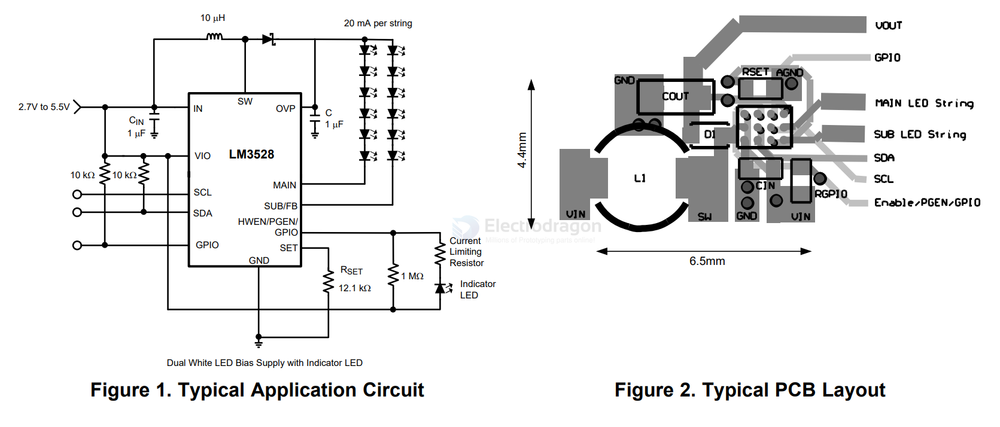

# LM3528-dat

- [[LED-driver-dat]] - [[TI-LED-driver-dat]] - [[LM3528-dat]]

FEATURES
128 Exponential Dimming Steps
Programmable Auto-Dimming FunctionUp to 90% Efficient
Low Profile 12 Bump DSBGA Package (1.2mmx 1.6mm x 0.6mm)
Integrated OLED Display Power Supply andLED Driver
Programmable Pattern Generator Output forLED Indicator Function
Drives up to 12 LED's at 20mA
Drives up to 5 LED's at 20mA and delivers 18Vat 40mA
1% Accurate Current Matching BetweenStrings
Internal Soft-Start Limits Inrush Current
True Shutdown Isolation for LED's
Wide 2.5V to 5.5V Input Voltage Range
22V Over-Voltage Protection
1.25MHz Fixed Frequency Operation
Dedicated Programmable General Purpose I/O
Active Low Hardware Reset

