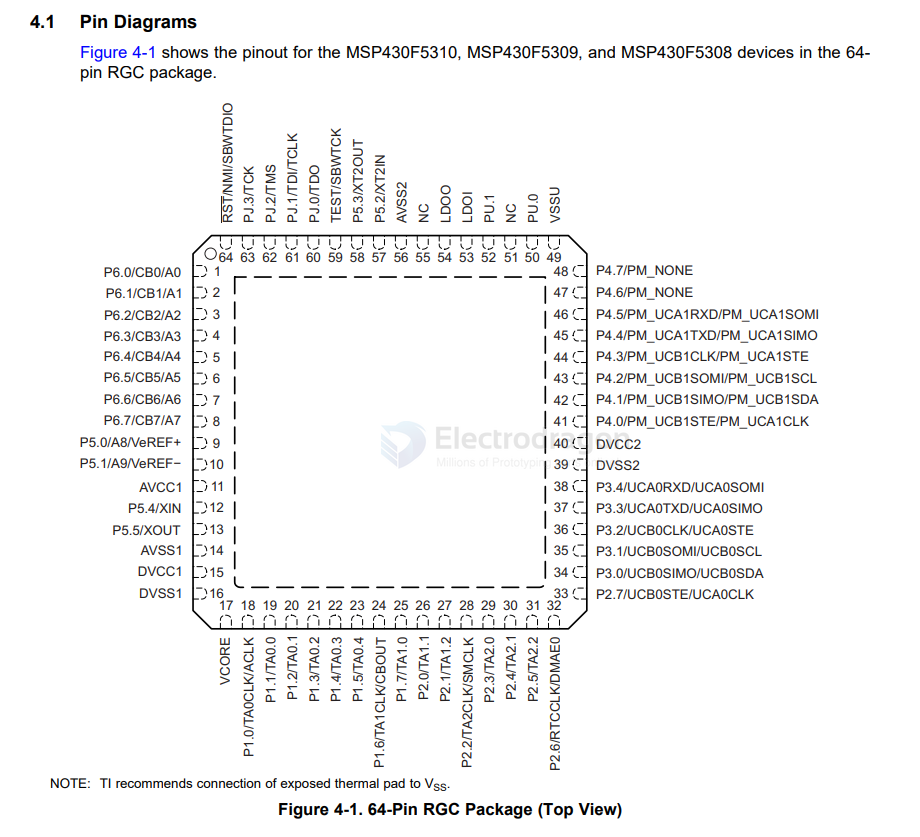

# MSP430-dat

- [[MSP430-SDK-dat]] - [[MSP430-dat]] - [[TI-dat]] - [[TI-MCU-dat]]

## board 
- [[DOD1060-dat]]

## info 

MIXED SIGNAL MICROCONTROLLER

https://www.ti.com/lit/ds/symlink/msp430g2553.pdf?ts=1770797613953

MSP430 is a family of microcontrollers designed and manufactured by Texas Instruments. The main focus in the MSP430 devices is the ultra-low-power consumption. There is a huge portfolio of these 16-bit RISC core devices (different peripherals, memory organization, power, temperature ranges, etc.).

MSP430 devices can run up to 25Mhz and the active power consumption of the most capable MSP430 chip is less than 500µA per MHz - that can be lowered even less if you disable the perihperals that you don't use or if you set up the different sleep modes. This makes them perfect for portable and hand-held devices.

- [[MSP430-SDK-dat]]

MSP430F5310IPT == 25 MHz MCU with 32KB Flash, 6KB SRAM, 10-bit ADC, comparator, DMA, UART/SPI/I2C, HW multiplier | PT | 48 | -40 to 85

https://www.ti.com/lit/ds/symlink/msp430f5310.pdf

MSP430F5438AIPZ == 25-MHz MCU with 256-KB flash, 16-KB SRAM, 12-bit ADC, DMA, UART/SPI/I2C, timer, HW multiplier | PZ | 100 | -40 to 85

## ref 

- [[ti-dat]] - [[mcu-dat]]